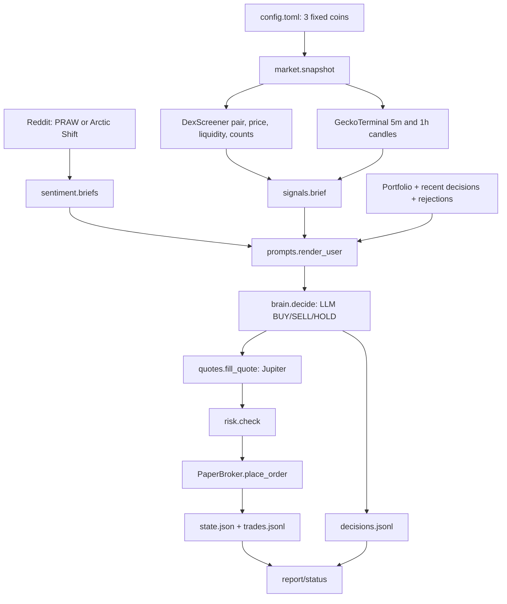
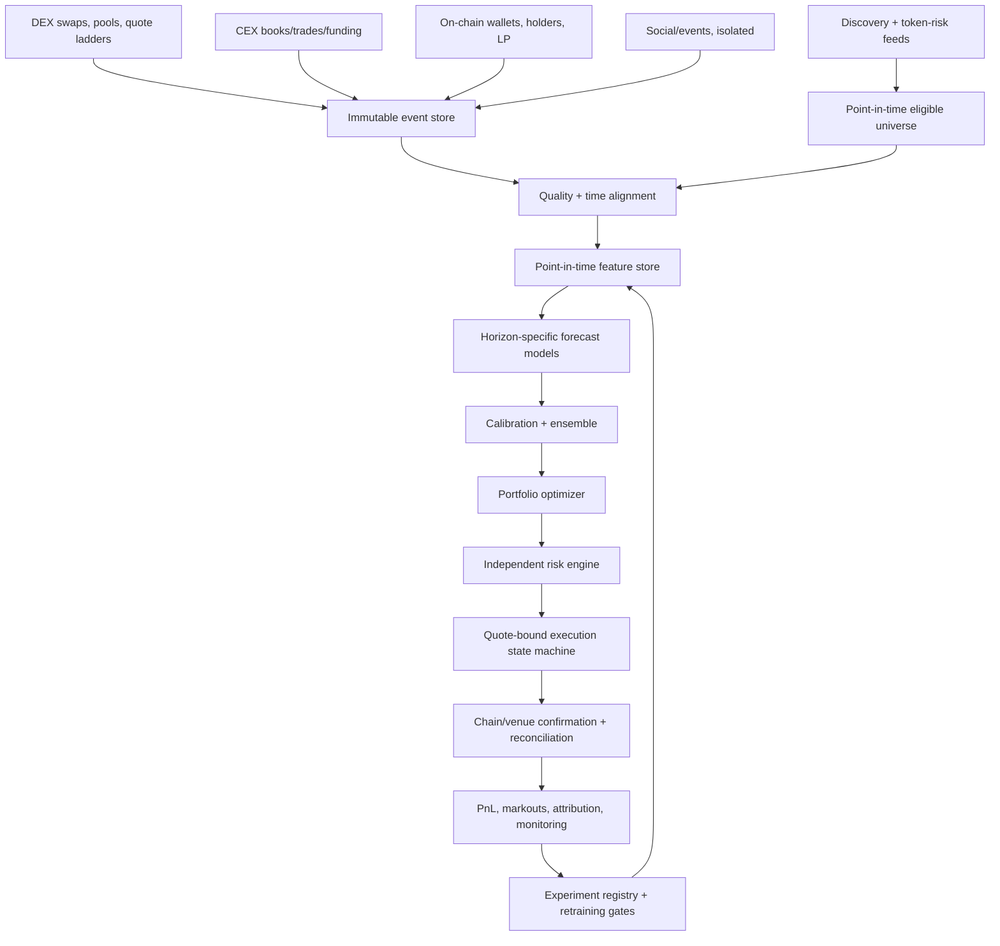
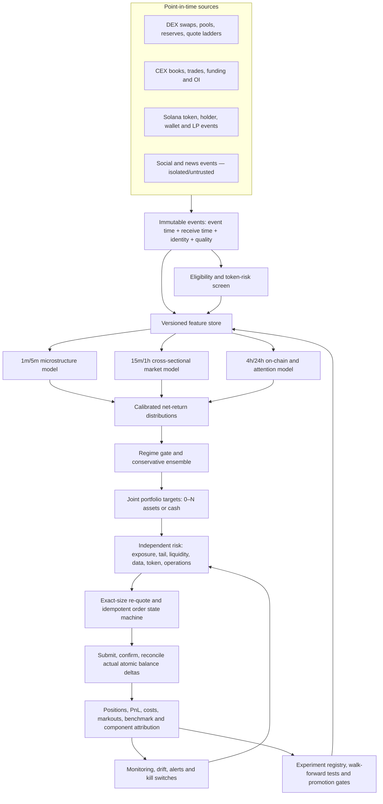

# Adversarial Audit of the Memecoin Trading System

**Review date:** 20 September 2026  
**Review standard:** sustainable, live, after-cost, risk-adjusted PnL—not code sophistication, backtest appearance, or persuasive model rationales.

## Scope and evidentiary limits

I inspected every supplied production module, the configuration, `pyproject.toml`, the README, and the accompanying architecture/run overview. I traced the paper-trade path from market read through journal persistence and compiled all supplied Python modules successfully. The repository described 528 tests and a 12-hour run, but the test files and raw run artifacts were not among the supplied files. I therefore could not execute or independently verify those tests, reproduce the reported run, or recompute its statistics. Where prose and source disagree, this review treats source as authoritative.

This is a static implementation and strategy audit, not a performance certification. No point-in-time research dataset, order/quote archive, wallet ledger, or statistically adequate trade history was supplied. Consequently, there is no credible estimate of expected return, Sharpe, capacity, or probability of ruin. Any feature described below as a candidate remains a hypothesis until it passes the proposed prospective and out-of-sample tests.

External evidence was prioritized in this order: primary research, official venue/API documentation, and then high-quality practitioner material. Results from broad cryptocurrencies, centralized exchanges, or slower horizons are not assumed to transfer to short-horizon Solana memecoins.

---

## 1. Executive Verdict

### Bottom line

**Do not deploy this system with real money. Suspend even claims that the paper results represent simulated executable PnL.**

The code is an orderly paper-trading prototype built to collect LLM state-policy-rationale records for three hard-coded tokens. It is not an alpha-research platform, not a trustworthy backtester, not a realistic execution simulator, and not a production trading system. Its central economic proposition—an LLM reading conventional indicators, coarse DEX statistics, and sparse Reddit data every 15 minutes can choose profitable BUY/SELL/HOLD actions—has not been demonstrated.

Worse, two accounting/execution defects can create economically impossible fills:

1. A SELL quote is requested for an estimated token quantity, but the exact Jupiter input and output amounts are discarded. The broker then treats the requested dollar notional as sale proceeds and derives token quantity from the route's effective price. Those two quantities do not generally correspond to the quoted swap.
2. Risk may clamp an order after it is quoted, but the paper broker executes the reduced notional using the original-size quote. That violates the supposedly exact-size execution model.

Those are not cosmetic bugs. They invalidate simulated inventory, cash, realized PnL, and any inference drawn from affected trades.

The system's own 12-hour account is negative and statistically empty: $1,000 became $996.81, five attempts included one simulated failure, and only one round trip closed. The model spent $3.48. Annualization would be nonsense, but the operating-cost hurdle is not: $3.48 per 12 hours is about $209 per 30-day month, or 20.9% of a $1,000 account, before infrastructure. Even the overview's post-cache-fix estimate of about $150/month is a 15% monthly hurdle. There is no evidence of alpha capable of paying it.

The correct rebuild is not “improve the prompt.” It is:

- make point-in-time data, executable prices, exact quantities, and replayability correct;
- define a dynamic eligible universe and permit zero positions;
- predict continuous **net** returns or rank opportunities at explicit horizons;
- use simple baselines, then calibrated tabular models only when they beat those baselines out of sample;
- optimize positions jointly under volatility, liquidity, turnover, and tail-risk constraints;
- make a separate deterministic risk service capable of refusing all trading;
- make execution an idempotent, reconciled state machine using actual settled balances;
- keep an LLM out of the final decision path. At most, use a frozen LLM offline to extract structured event features, and preserve it only if an ablation shows incremental net out-of-sample value.

### What the current system actually does

- Trades no live money; it has no signer, wallet, or live broker.
- Watches fixed BONK, WIF, and POPCAT definitions from `config.toml`.
- Every 60 seconds, selects a DexScreener pool, marks positions at its reported price, and checks a fixed −15% stop.
- Every 15 minutes, adds GeckoTerminal 5-minute and 1-hour candles plus Reddit-derived attention/polarity features.
- Computes RSI, EMAs/MACD, Bollinger metrics, ATR, relative volume, swing distances, price changes, transaction-count ratios, turnover, and one-snapshot liquidity change.
- Renders those values, portfolio state, recent LLM outputs, and raw Reddit excerpts into a prompt.
- Calls an Anthropic model for one BUY/SELL/HOLD action per configured coin, including dollar size, self-reported confidence, and prose reasoning.
- Quotes proposed swaps through Jupiter, applies a small set of deterministic limits, simulates a fill, updates a JSON state file, and appends JSONL ledgers.

It does **not** discover the strongest coins, estimate expected return, calibrate confidence, construct a portfolio, model covariance, validate alpha, replay historical state, simulate the AMM or chain, reconcile executions, or calculate most decision-grade performance metrics.

### Defensibility of the fundamental architecture

The pattern “market/social text → general-purpose LLM → categorical trade → order” is not defensible as the default architecture for this problem. It lacks a supervised economic objective, calibrated output, stable decision boundary, cost-aware target, and reproducible model version. It also expands the attack surface: adversarial social text is inserted into the same context that controls trades.

Recent prospective evidence is not favorable. A daily LLM stock-selection study found attention- and momentum-heavy, poorly diversified portfolios without statistically significant abnormal returns; the AI-Trader benchmark similarly found that general reasoning ability does not imply trading skill and that most tested agents had weak risk-return outcomes. These studies do not prove that every LLM-derived feature is useless, but they eliminate any presumption that an LLM deserves order authority. See [NBER, *AI and Household Portfolios*](https://www.nber.org/system/files/working_papers/w35153/w35153.pdf) and [AI-Trader benchmark](https://arxiv.org/html/2512.10971v1).

### Strongest parts

- Clear module boundaries for market, signal, model, risk, broker, portfolio, journal, and reporting concerns.
- Typed internal records and structured model output.
- A deterministic risk-gate concept independent of the model.
- Distinction between unavailable data and a literal zero in several presentation paths.
- Separate fast risk and slow research cadences.
- Atomic replacement for the state snapshot, explicit model-failure reporting, degraded-data flags, and API-cost accounting.
- Honest documentation that one round trip and 12 hours do not prove anything.

These are useful engineering bones. They are not evidence of edge.

### Most dangerous assumptions

1. A fluent rationale is treated as evidence of a forecast.
2. Jupiter quote-time output is treated as a fill.
3. A selected pool's displayed price is treated as executable liquidation value.
4. Three fixed, highly correlated assets are treated as an opportunity universe.
5. Counts of buys and sells are described as “actual money moving,” although they are neither notional flow nor necessarily unique economic actors.
6. A fixed −15% stop is treated as protection against discontinuous rugs, liquidity withdrawal, or execution failure.
7. Backtest-style conclusions embedded in the prompt are treated as settled despite no accessible experiment registry or data.
8. Missing and malformed market fields can become zero or neutral values and still reach the decision maker.
9. Conventional indicator transformations are treated as independent evidence.
10. A quote fallback invented from mid-price is allowed to become an executable paper fill.

### Highest-value changes

1. Freeze real-money development and fix the fill/accounting invariants.
2. Delete the LLM from trade selection and sizing.
3. Build an event-time, point-in-time research store and deterministic replay engine.
4. Build a dynamic, risk-screened universe with cash as a valid default.
5. Establish net-return baselines and an exact-size execution/capacity model.
6. Validate candidate market, microstructure, on-chain, and attention features through purged walk-forward tests and locked prospective tests.
7. Build a transactional, idempotent execution and reconciliation service before attaching any signer.

**No supplied result demonstrates positive alpha. Every signal in the current policy should be treated as an unproven hypothesis.**

---

## 2. Current Architecture

### Current code-level flow

### Lifecycle of one potential trade today

| Stage | Current implementation | Material observation |
|---|---|---|
| Asset discovery | None. `config.toml:9–23` supplies BONK, WIF, POPCAT. | The stated “find the strongest three” objective is not implemented. |
| Market collection | `market.snapshot()` calls DexScreener, dynamically chooses the deepest accepted pair, then optionally obtains 5m/1h GeckoTerminal candles. | Pair identity may change between observations. Snapshot time is local completion time, not source event time. |
| Social collection | `sentiment.briefs()` scans Reddit through PRAW or Arctic Shift, matching configured aliases and caching hourly counts. | Sparse, platform-specific, delayed, bot-prone, and not synchronized to market event time. |
| Feature generation | `signals.technicals()` and `signals.flow_brief()` produce technical and coarse flow features. | Mostly correlated price transforms; no cross-sectional normalization, stable pool key, or explicit target horizon. |
| Prompt construction | `prompts.build_system()` + `render_user()` include policy, limits, portfolio, history, evidence, and raw top-post/comment text. | Configuration is duplicated; raw public text is an indirect prompt-injection channel. |
| Model decision | `brain.decide()` uses structured output; `_normalize()` repairs missing, duplicate, and invalid-symbol actions. | One action is forced for every coin. No expected return, distribution, cost hurdle, calibration, or model ablation. |
| Quote | `quotes.fill_quote()` calls Jupiter legacy `/swap/v1/quote`; any failure creates an adverse fixed-bps fallback. | Exact route input/output are discarded. Fallback is non-executable but can trade on paper. |
| Risk | `risk.check()` checks local snapshot age, quote presence, impact, selected-pool liquidity, minimum order, per-name cap, cash, and inventory. | It can clamp size without requoting. No portfolio/correlation/drawdown/regime/data-health controls. |
| Paper execution | `PaperBroker.place_order()` applies an independent 6% failure coin flip, fixed gas, quoted effective price, and JSON accounting. | Quote is not a fill; SELL quantities/proceeds can be impossible; no partial-fill or route-state model. |
| Position management | 60-second `fast_tick()` marks at DexScreener and applies a fixed −15% stop. `slow_tick()` checks stops again before the LLM. | Stops are polling-based, can execute during a nominal dry run, and can be followed immediately by an LLM re-entry. |
| Exit | LLM SELL or forced fixed stop. | No horizon-based decay, executable-value stop, liquidity exit, time exit, or portfolio de-risking. |
| PnL | Cash + positions marked at DexScreener; cost basis includes simulated gas and configured explicit fees. | Mark is not liquidation value; implicit AMM cost is not attributed; operational/model cost is outside book PnL. |
| Persistence | Broker appends a trade then atomically replaces state; decisions append separately. | A crash can leave log and state inconsistent; no transaction, sequence number, process lock, idempotency, or reconciliation. |

### Timing and state

- `fast_tick()` at approximately 60 seconds: price-only snapshot → mark → stop scan → possible forced paper sell.
- `slow_tick()` at approximately 900 seconds: full snapshot → stop scan → technical/social evidence → model → sequential per-coin risk/execution → decision journal.
- `decision_baseline` records the last snapshot that reached the model, while `previous` is the most recent snapshot.
- The loop uses wall-clock time rather than a monotonic scheduler and performs source calls sequentially, so inputs within one “snapshot” are not simultaneous.

### Current operations and failure behavior

| Concern | What exists now | Assessment |
|---|---|---|
| Configuration | Frozen dataclasses loaded from `config.toml`, with startup validation. | Directionally sound, but strategy/risk/infrastructure concerns share one file and configuration is not versioned with decisions. |
| Secrets | Anthropic, Reddit, and Jupiter credentials are loaded from environment/`.env`; there is no signer because trading is paper-only. | Appropriate for local development. A live system needs managed secrets, rotation, signer isolation, least privilege, and audit trails. |
| HTTP | Shared `httpx` client construction, timeout, OS trust store, and source-specific handling. | No general retry budget, exponential backoff/jitter, circuit breaker, request lineage, or redundant-provider policy. Retries for submissions must be idempotent, not generic. |
| Rate limits | Gecko calls are manually delayed; source failures often degrade or skip data. | Static sleeps do not provide adaptive budgeting, header-aware backoff, or global coordination across processes. |
| Error handling | Candle and social failures can degrade independently; model failure skips a tick; quote failure silently becomes a synthetic quote. | Partial degradation is useful, but critical data must fail closed. Quote fallback is actively unsafe. |
| Logging | Python logs plus `trades.jsonl` and `decisions.jsonl`; model usage is recorded. | Useful audit prototype, but no metrics, traces, alert routing, SLOs, or immutable causal IDs. |
| Recovery | Atomic state-file replacement; state reload on startup. | No replay/reconciliation after append/save split, no leader lock, and no protection against duplicate concurrent processes. |
| Research/live parity | One paper broker protocol; no backtest or live broker. | There is no demonstrated parity to assess. A future live path must not fork strategy semantics. |

### What is absent from this architecture

There is no historical research runner, point-in-time universe database, walk-forward model trainer, model registry, feature registry, real execution adapter, order state machine, reconciliation loop, market-impact calibration, benchmark attribution, portfolio optimizer, streaming book, on-chain risk engine, or kill-switch service. The project is therefore much closer to an LLM paper-trade demonstrator than an algorithmic trading platform.

---

## 3. Critical Problems

### C1 — No evidence that the strategy has alpha

**Problem:** There is no trustworthy backtest or adequate prospective sample. The reported run contains one closed round trip.

**Why it matters:** Strategy selection from one outcome is pure noise. Win rate, Sharpe, expectancy, tail behavior, regime sensitivity, and capacity cannot be estimated.

**Evidence:** The overview reports 147 per-coin actions, 142 HOLDs, four BUYs, one SELL, five attempts, and one completed BONK round trip over 12 hours. The supplied source has no backtest module. The described tests were unavailable and, in any case, software unit tests would not establish alpha.

**PnL impact:** Unknown expected value. Any capital allocation is gambling on an unmeasured policy.

**Recommended change:** Stop strategy claims. Build the point-in-time research/replay stack in Sections 12–14 and require locked out-of-sample plus prospective paper evidence.

**Priority:** **Critical / trading blocker**

### C2 — SELL quotes and ledger quantities are internally inconsistent

**Problem:** `quotes.fill_quote()` (`quotes.py:286–380`) converts a requested dollar SELL into token input using the DexScreener mid, obtains Jupiter `inAmount` and `outAmount`, calculates an effective price, then discards both exact amounts. `PaperBroker.place_order()` (`broker.py:142–264`) sets `filled_usd` to the requested dollars and calculates `quantity = filled_usd / quote.price_usd`.

**Why it matters:** A swap has exact token input and expected/actual USDC output. One cannot independently choose dollar proceeds and effective price after the route is returned.

**Evidence:** If $100 is requested at a $1 mid, Jupiter may quote selling 100 tokens for $95, an effective price of $0.95. The broker records $100 proceeds and $100 / $0.95 = 105.263 tokens sold. Neither quantity matches the route.

**PnL impact:** Cash can be overstated, inventory understated, cost basis released incorrectly, and realized PnL fabricated. All affected SELL results are invalid.

**Recommended change:** Make quote and fill records carry integer atomic `input_amount`, `expected_output_amount`, decimals, route ID, slot/expiry, and fees. A simulated fill must use the route amounts after latency/impact adjustment; a live fill must use confirmed transaction balance deltas.

**Priority:** **Critical / accounting blocker**

### C3 — Risk-clamped orders reuse the wrong quote

**Problem:** `_apply()` quotes `action.size_usd` (`loop.py:384–411`), `risk.check()` may reduce it (`risk.py:212–319`), and the broker executes `approved_usd` against the original quote.

**Why it matters:** AMM and routed-swap prices are size-dependent. The quote is bound to an exact input amount.

**Evidence:** No second `fill_quote()` occurs after a max-position, cash, or inventory clamp.

**PnL impact:** It corrupts simulated price impact and quantity. Depending on side and curve shape it can be optimistic or pessimistic, so even the sign of bias is unstable.

**Recommended change:** Risk should return a maximum permitted size, not approve an order. The execution service must optimize size, request an exact-input quote at that size, bind the quote hash/amount to the order, re-run final risk checks, and reject on any mutation.

**Priority:** **Critical / simulation blocker**

### C4 — Synthetic degraded quotes are treated as executable

**Problem:** Any Jupiter failure produces a local price equal to the DexScreener mid plus/minus a fixed fallback (`quotes.py:248–278`, `286–397`). Normal risk does not reject `quote.degraded`, and the paper broker can record a fill.

**Why it matters:** A routing outage, unsupported token, stale decimal lookup, or market dislocation is precisely when a mid-price fiction is least credible.

**Evidence:** The fallback sets `degraded=True` but `risk.check()` has no degraded-quote veto.

**PnL impact:** Creates fills that could not have occurred and systematically hides outage/liquidity risk.

**Recommended change:** Degraded/no-route data means **no new trade**. For emergency risk reporting, calculate a conservative liquidation estimate separately; never journal it as an execution.

**Priority:** **Critical / backtest-integrity blocker**

### C5 — A Jupiter quote is modeled as a fill

**Problem:** The simulator treats quote-time `outAmount` and one fixed price-impact value as realized execution, adds a constant gas charge, and samples a venue-independent 6% transaction-failure rate.

**Why it matters:** A quote can stale before signing, priority fees and route state change, transactions expire, competing flow moves pools, and confirmed output can differ. Official Jupiter documentation says to sign/submit promptly, notes quote staleness, and returns actual input/output after `/execute`; Solana transactions also have finite recent-blockhash validity. See [Jupiter quote semantics](https://developers.jup.ag/docs/swap/v1/get-quote), [Jupiter order/execute](https://developers.jup.ag/docs/swap/order-and-execute), and [Solana confirmation/expiry](https://solana.com/developers/cookbook/transactions/confirmation).

**Evidence:** `broker.py` has no latency, block height, confirmation, parent-order partial-completion/route-change, priority-fee, sandwich, or observed failure model. A single Solana swap transaction is normally atomic, but a sliced target can still be only partly completed when some transactions fail or expire.

**PnL impact:** Usually optimistic execution, unknown capacity, and false certainty around exits. MEV can be an additional economic tax in permissionless execution; see the [BIS MEV review](https://www.bis.org/publications/bulletin-58-miners-intermediaries-extractable-value-and-market-manipulation-crypto-and-defi.pdf).

**Recommended change:** Archive size-specific quotes and subsequent realized route outcomes; replay latency and failure conditional on network/route state. For live orders, persist intent before submission and reconcile confirmed balance deltas.

Priority fees must be observed or estimated from current chain conditions rather than represented by a constant; see [Solana's priority-fee guidance](https://solana.com/developers/cookbook/transactions/add-priority-fees).

**Priority:** **Critical**

### C6 — The LLM has order authority without measured predictive value

**Problem:** A general LLM emits direction, size, and confidence from a prose prompt. Its objective is not trained on executable net returns, confidence is not calibrated or used, and model/prompt drift can change behavior.

**Why it matters:** Natural-language coherence is not a forecasting statistic. BUY/SELL/HOLD collapses magnitude and uncertainty and prevents explicit comparison with the cost hurdle.

**Evidence:** `types.Action` (`types.py:421–435`) contains action, dollars, self-confidence, and rationale, but no forecast horizon, expected return, variance, quantile, probability of positive net return, or model calibration ID. The code has no competing quantitative baseline or ablation.

**PnL impact:** Unknown alpha, material inference cost, nonstationary behavior, poor reproducibility, and an unnecessary attack surface.

**Recommended change:** Remove the LLM from direction, size, and execution. Use calibrated expected-net-return or cross-sectional ranking models. If unstructured event extraction is tested, isolate it as a lagged, schema-validated feature and require incremental locked-test performance.

**Priority:** **Critical / strategy redesign**

### C7 — Public social text can inject instructions into the trader

**Problem:** Raw top Reddit post/comment text is interpolated into the user prompt (`sentiment.py:761–775`; `prompts.py:394–433`).

**Why it matters:** Any public author could include instructions targeting the model. This is indirect prompt injection in a high-impact control loop.

**Evidence:** There is no trust-boundary encoding, content classifier, instruction stripping, source sandbox, adversarial evaluation, or rule prohibiting the model from treating quoted text as commands. Anthropic explicitly identifies third-party content as an indirect prompt-injection vector and recommends structured boundaries, screening, and least privilege; it also notes the problem is not solved. See [Anthropic guardrail guidance](https://platform.claude.com/docs/en/test-and-evaluate/strengthen-guardrails/mitigate-jailbreaks) and [Anthropic prompt-injection research](https://www.anthropic.com/research/prompt-injection-defenses).

**PnL impact:** Adversarial trades, denial of service, or manipulated sizing.

**Recommended change:** Do not expose public text to a component with order authority. Extract narrow fields in an isolated service, encode source text as data, apply strict schemas and allowlists, and make the deterministic trading model incapable of interpreting instructions.

**Priority:** **Critical / security blocker**

### C8 — Stops and portfolio marks use a non-executable, unstable reference

**Problem:** Positions are marked at the selected DexScreener pool price. If a mark is missing, `portfolio.mark()` carries the position at cost basis. The exit is routed through Jupiter, potentially across different pools.

**Why it matters:** Risk must be measured at estimated liquidation value for the actual order size, not a displayed mid from one pool. Carrying a missing asset at cost can show zero loss during a rug or data outage.

**Evidence:** `loop.py:172–178`, `market.py:162–201`, and `portfolio.py:27–67`. Pair selection can also switch from one snapshot to another without a continuous pair key. More seriously, when no SOL/USDC/USDT-quoted pool exists, `_best_pair()` returns the best untrusted pool with a warning; `risk.check()` does not veto a degraded coin snapshot, so a potentially fabricated quote-token valuation may still mark the book or support an entry.

**PnL impact:** Understated drawdown, late/false stop triggers, and misleading exposure.

**Recommended change:** Mark open inventory using conservative executable bid-side route ladders at position size, with explicit haircut when unavailable. Track pool identity and aggregate all economically relevant liquidity. A degraded/untrusted pair may be diagnostic data, never an entry price. Missing liquidation data should escalate risk and block entries—not mark at cost.

**Priority:** **Critical**

### C9 — No real universe selection or token safety screen

**Problem:** Exactly three configuration entries are always the universe. There is no discovery, point-in-time eligibility record, contract/authority inspection, holder/dev concentration, LP ownership, transfer restriction, or manipulation screen.

**Why it matters:** Opportunity and tail risk in memecoins are cross-sectional. Fixed membership creates selection bias and concentration while missing new opportunities; naïve expansion into new tokens without contract screening creates rug/honeypot risk.

**Evidence:** `config.toml:9–23`; no universe or on-chain risk module exists. Solana Token-2022 supports features such as transfer fees, permanent delegates, default-frozen accounts, transfer hooks, pausing, and mint-close behavior that a risk engine must understand; see [Solana token extensions](https://solana.com/docs/tokens/extensions).

**PnL impact:** Concentrated meme beta, survivorship bias, missed opportunities, and potentially total loss in malicious assets.

**Recommended change:** Maintain a point-in-time eligible universe and permit 0–N positions. Separate established liquid memes from new-launch/event strategies. Hard-veto unsafe authorities/extensions/liquidity ownership before alpha scoring.

**Priority:** **Critical before universe expansion**

### C10 — Risk controls are inadequate for correlated, discontinuous assets

**Problem:** The main controls are 30% per name, a −15% stop, 3% maximum quoted impact, selected-pool liquidity, minimum trade, and cash/inventory constraints.

**Why it matters:** Three meme positions can reach 90% gross and collapse together. A stop cannot cap loss across gaps, liquidity withdrawal, route failure, or frozen transfers. A 3% one-way impact allowance can imply more than 6% round-trip impact before other costs.

**Evidence:** `risk.py:85–319`; no portfolio beta/correlation, total exposure, volatility target, daily/weekly loss, drawdown breaker, quote-age, spread, route, chain-health, consecutive-failure, contract-risk, or market-regime controls.

**PnL impact:** Catastrophic correlated drawdown and unfavorable-execution churn.

**Recommended change:** Implement independent pre-trade, continuous, and post-trade risk layers as specified in Sections 11–12. Default to cash when any critical input is uncertain.

**Priority:** **Critical / live-trading blocker**

### C11 — Persistence and execution are not transactional or idempotent

**Problem:** `_commit()` appends a trade then saves state (`broker.py:380–388`); action processing is sequential; decisions are journaled after all actions.

**Why it matters:** A crash between append and save leaves the ledger ahead of state. A retry can duplicate intent. Earlier orders can mutate state before a later exception prevents a complete decision record.

**Evidence:** No order ID, decision ID, unique constraint, database transaction, sequence, WAL recovery, process lock, or venue reconciliation exists.

**PnL impact:** Duplicate orders, orphaned fills, unexplained balances, and inability to recover safely.

**Recommended change:** Use a transactional order ledger and explicit state machine: proposed → risk-approved → quote-bound → submitted → landed/failed/expired → reconciled. Derive positions from immutable fills and confirmed balance deltas.

**Priority:** **Critical / production blocker**

### C12 — `--dry-run` can liquidate positions

**Problem:** The CLI describes dry-run as non-mutating (`cli.py:57–68` and README), but `slow_tick(dry_run=True)` enforces stops before `_apply()` and calls `_force_exit()`, which invokes the broker without consulting `dry_run` (`loop.py:278–294`, `200–275`).

**Why it matters:** An operator testing a decision path can change positions and cash.

**Evidence:** The dry-run guard exists only in `_apply()` at `loop.py:406`, after the independent stop path.

**PnL impact:** Unexpected liquidation and false confidence in operational controls.

**Recommended change:** Propagate an immutable execution mode through all paths. In dry-run, calculate a hypothetical stop verdict/fill without any state or ledger mutation. Add a state-hash-before/after integration test.

**Priority:** **Critical defect**

---

## 4. What I Would Delete

| Component | Decision | Reason |
|---|---|---|
| LLM as final BUY/SELL/HOLD and sizing authority | **Delete** | No demonstrated forecast value; expensive, unstable, difficult to calibrate, and injection-prone. |
| Raw Reddit text in the execution prompt | **Delete** | Direct adversarial input to a capital-allocation component. |
| Fixed “three coins” policy | **Delete** | Arbitrary concentration; not an asset-selection method. |
| Requirement for exactly one action per coin per tick | **Delete** | Creates fake decisions and inhibits sparse opportunity-driven trading. |
| Keyword polarity feature | **Delete from live path** | Context-poor, easy to manipulate, and unsupported as incremental short-horizon alpha. |
| Fixed-bps synthetic fallback fills | **Delete** | Non-executable data should not become a trade. |
| Prompt-embedded claims that indicator count, no trailing stop, and other policy choices are “settled” | **Delete** | They are undocumented multiple-testing results in the supplied evidence and anchor the model to past overfit. |
| Recent LLM rationale/history as an input to future trades | **Delete** | It encourages self-consistency, not correctness; there are no counterfactual labels. |
| Self-reported LLM confidence | **Delete** | It is uncalibrated and unused by risk or sizing. |
| Static 6% iid failure model and constant gas as a realism claim | **Delete/replace** | Failure and cost are conditional on network, route, priority fee, and transaction construction. |
| 1,642-line Reddit subsystem from the critical trading path | **Park behind a feature flag** | Complexity is disproportionate to measured data density and unproven value. Preserve only as an experiment source. |
| Prompt-cache optimization work | **Defer** | Optimizing inference cost is pointless until the LLM earns a role. |
| `__init__.py:hello()` scaffold | **Delete** | Dead code. |

Traditional indicators need not all be physically removed from the research repository. They should be demoted to benchmark features and retained only if registered ablations show stable incremental net value.

---

## 5. What I Would Keep

| Existing element | Keep, with changes |
|---|---|
| Module separation | Keep the adapter boundaries; reorganize them around immutable events and shared research/live interfaces. |
| Typed records and structured output | Keep, but add units, atomic amounts, source/event/receive times, schema versions, IDs, and strict finite validation. |
| Deterministic risk gate | Keep the concept; make it independent, portfolio-aware, stateful where necessary, and able to fail closed. |
| Fast risk cadence vs slower signal cadence | Keep the separation. For live operation, make prices/risk event-driven and let slow features update asynchronously. |
| Explicit degraded-data state | Keep, but degraded critical inputs must veto entries rather than invite model “discounting.” |
| Model/API usage accounting | Keep for all-in economics and capacity reporting. |
| Distinction between API/model failure and HOLD | Keep. Failure is not a trading opinion. |
| Atomic replacement of a local state snapshot | Keep only as a crash-safe cache. The source of truth should be a transactional ledger. |
| Trade and decision journals | Keep the audit intent; add immutable IDs, hashes, lineage, exact input snapshots, and reconciled outcomes. |
| Reversal of newest-first candle responses | Keep, after adding timestamp, gap, duplicate, and completeness validation. |
| Fee/gas in cost basis | Keep the accounting principle; replace estimates with actual confirmed economic costs. |
| No wallet or signer in the prototype | Keep until all research and operational gates pass. |
| Candid 12-hour write-up | Keep the transparency. Do not reinterpret it as performance evidence. |

---

## 6. Missing Capabilities

| Missing component | Why it matters | Impact | Priority | Implementation |
|---|---|---:|---|---|
| Point-in-time universe and delisting history | Prevents survivorship bias and enables genuine cross-sectional selection. | Research validity / alpha | **Critical** | Persist every eligibility decision with source times, reasons, pair/mint identity, and future delist/rug outcomes. |
| Raw immutable event store | Research must reconstruct exactly what was knowable at a decision time. | Leakage / reproducibility | **Critical** | Append market, quote, swap, chain, social, and reference events with event time, receive time, slot/sequence, source, and quality. |
| Executable quote ladder by size | Mid-prices do not show spread, impact, or capacity. | Net PnL / sizing | **Critical** | Capture buy and sell quotes at standard sizes and record route inputs/outputs, age, expiry, fees, and route composition. |
| Deterministic replay/backtest engine | There is no way to test signals or recover historical decisions. | Alpha validation | **Critical** | Event-time clock, point-in-time joins, shared strategy/portfolio/risk interfaces, and order-state replay. |
| Transactional order/fill ledger | Prevents duplicates and permits crash recovery/reconciliation. | Capital safety | **Critical** | PostgreSQL or equivalent with unique client IDs, state transitions, immutable fill events, and transactional outbox. |
| Live reconciliation | Internal positions must equal settled wallet/venue balances. | Capital safety | **Critical** | Reconcile after every transaction and periodically; halt on any unexplained delta. |
| Independent kill switch | An unhealthy strategy or venue must stop immediately. | Tail risk | **Critical** | Manual and automatic global/venue/asset kills; out-of-band control; default closed. |
| Contract/token risk service | Memecoin loss can be contractual rather than market-driven. | Ruin avoidance | **Critical** | Inspect mint/freeze/extension/delegate authorities, transfer hooks/fees, LP ownership, holder/dev concentration, and sellability. |
| Portfolio risk engine | Per-name caps do not control correlated meme beta. | Drawdown | **Critical** | Total/gross/net exposure, beta, factor/correlation, volatility, concentration, rolling loss, and drawdown budgets. |
| Stale/gap/clock validation | Local request completion time is not information time. | Leakage / bad orders | **Critical** | NTP/clock monitor, source/receive timestamps, maximum lateness, sequence gaps, and completeness watermarks. |
| Data-quality quarantine | Missing/malformed values currently become plausible numbers. | False signals | **Critical** | Schema validation, finite/range checks, duplicate/gap checks, quarantine, health scoring, no-trade thresholds. |
| Research experiment registry | Prevents undocumented parameter mining. | Overfit control | **High** | Pre-register hypothesis, features, split, hyperparameter budget, costs, metrics, and decision before running. |
| Model/feature registry | Recreates any historical forecast and detects drift. | Reproducibility | **High** | Hash data snapshot, code, schema, feature definitions, model, prompt (if any), and calibration. |
| Cross-sectional baseline models | Establishes whether complexity adds value. | Alpha discovery | **High** | Cash, equal-weight, simple residual momentum, linear/logistic, and GBT baselines. |
| Confidence/calibration layer | Position sizes require forecast distributions, not prose confidence. | Sizing / risk | **High** | Walk-forward calibration, reliability curves, prediction intervals, conformal/bootstrap uncertainty. |
| Capacity and impact model | A signal is worthless at unexecutable size. | Scalable PnL | **High** | Size/route/volatility-conditioned impact curves; reject above conservative participation/impact limits. |
| Benchmark and factor attribution | Separates skill from SOL/BTC/meme beta. | Truthfulness | **High** | Point-in-time benchmarks, factor regression, counterfactual replays, markouts, cost attribution. |
| Real alerting and observability | Logs do not guarantee detection or response. | Operations | **High** | Metrics, traces, SLOs, paging, venue/data dashboards, decision/fill lineage, runbooks. |
| Shadow and canary modes | Tests live plumbing without capital or with tightly bounded capital. | Deployment safety | **High** | Shadow intents against live quotes; then tiny-capital canary with automatic rollback. |
| On-chain wallet/LP history | Candidate slow signals and safety screens require historic state. | Alpha / risk | **High** | Archive transfers, holder snapshots, LP changes, program events, and entity labels point in time. |
| CEX microstructure/regime feeds | Listed memes may inherit price discovery/funding/liquidation pressure from CEXs. | Signal/regime | **Medium** | Sequence-correct L2/trades, funding, OI, basis, liquidations; only for assets with defensible mapping. |
| Social identity/bot/coordination model | Raw counts are highly gameable. | Signal integrity | **Medium** | Deduplication, unique-author history, bot likelihood, community normalization, influence concentration, campaign detection. |
| Tax/compliance/accounting export | Required for real operation. | Operational/legal | **Medium** | Jurisdiction-specific advice and immutable realized-lot export; out of scope for alpha but not deployment. |

---

## 7. Data Review

### Current and candidate data sources

| Source or feature | Classification | Assessment and required action |
|---|---|---|
| DexScreener price | **MODIFY** | Useful for discovery/reference, not as an executable mark. Retain source event time if available, pair identity, and cross-source validation. |
| DexScreener selected-pool liquidity | **MODIFY** | A useful warning, but one pool is not route liquidity. Track stable pool IDs, reserves, LP ownership, and aggregate executable route depth. |
| DexScreener volume | **TEST** | Potential abnormal-activity feature, but susceptible to wash trading and venue coverage changes. Normalize by time-of-day, liquidity, and reliable-venue universe. Research on DEX wash trading shows volume can be seriously contaminated; the cited Ethereum result is not directly transferable to Solana but establishes the risk ([Victor & Weintraud](https://arxiv.org/pdf/2102.07001v1.pdf)). |
| DexScreener buy/sell transaction counts | **REMOVE as “flow”; TEST as a weak feature** | Counts are not notional, aggressor volume, or unique wallets. The prompt's “actual money moving” description is false. Replace with signed notional and entity-aware flow where possible. |
| DexScreener price-change ladder | **TEST** | Equivalent to returns at several horizons; useful as simple baselines after timestamp validation and residualization. |
| Pair creation time | **KEEP/MODIFY** | Useful for eligibility and lifecycle risk, subject to pair/token identity checks. Age is primarily a risk/regime feature. |
| FDV | **TEST** | Often economically fragile for low float; combine with circulating supply, holder concentration, and liquidity rather than treat as valuation. |
| GeckoTerminal 5m/1h OHLCV | **MODIFY** | Viable for slow research, but validate gaps, duplicates, future bars, OHLC invariants, pool continuity, and closed-bar availability. CoinGecko documents that empty intervals may be skipped unless requested, so naïve row-based windows distort time ([pool OHLCV docs](https://docs.coingecko.com/reference/pool-ohlcv-contract-address)). |
| Dynamically selected “most liquid” pool candles | **REMOVE as a continuous series** | A pool switch creates a synthetic price/liquidity regime. Persist pool membership and either build a controlled consolidated series or restart pool-specific features. CoinGecko also notes token OHLCV can use the most liquid pool, which can change ([token OHLCV docs](https://docs.coingecko.com/reference/token-ohlcv-token-address)). |
| Jupiter quote | **KEEP/MODIFY** | The best current component for executable-price evidence. Store exact input/output, route, expiry/slot, context, threshold, quote latency, and size ladder; never equate quote with fill. Prefer current `/order` + `/execute` for future live integration ([official documentation](https://developers.jup.ag/docs/swap/order-and-execute)). |
| Fixed gas cost | **REMOVE** | Replace with actual fee/priority/tip records and state-conditioned simulation. |
| iid 6% failure probability | **REMOVE** | Calibrate failures by chain congestion, quote age, route, slippage, priority fee, program error, and client behavior. |
| Reddit submissions/comments | **TEST only** | Current data were nearly absent in the documented run. Collect prospectively, respect Reddit terms, de-duplicate, normalize by community, and test at slower horizons. Review [Reddit Data API terms](https://redditinc.com/policies/data-api-terms). |
| Absolute keyword polarity | **REMOVE** | Highly gameable and context-poor; sarcasm, memes, negation, multilingual text, and symbol ambiguity make it unreliable. |
| Mention velocity | **TEST** | More plausible than absolute sentiment, but use unique authors/content clusters, platform coverage, and point-in-time denominators. |
| Mention z-score | **MODIFY/TEST** | Current baseline overlaps the current one-hour window through prior rolling buckets (`sentiment.py:553–581`) and uses Gaussian standardization on sparse zero-inflated counts. Use non-overlapping buckets and empirical or count-distribution residuals. |
| Unique contributor ratio | **TEST** | A potential coordination/concentration measure; account age/history and cross-post duplication are needed. |
| Raw top-post text | **REMOVE from trading path** | Injection and manipulation risk. If researched, isolate extraction and use only lagged structured outputs. |
| Search trends | **TEST at 4h–24h** | Potential attention innovation, probably too delayed for 1–15m execution; require timestamp and revision analysis. |
| Order-book imbalance | **TEST for CEX-listed assets** | Plausible at seconds/minutes if sequence-correct and venue-specific. It is not directly available for AMM-only tokens. |
| AMM reserve/route imbalance and quote-curve slope | **KEEP as priority research** | More relevant DEX microstructure: price impact across size, reserve change, route concentration, and quote deterioration. |
| Aggressor-side notional flow | **KEEP as priority research** | Superior to transaction counts if decoded correctly; dedupe routed legs and flag self/wash patterns. |
| Realized volatility/jumps | **KEEP as risk; TEST as signal** | Essential for scaling, regime, and tail controls. Predictive direction is an empirical question. |
| Cross-sectional residual momentum | **TEST as core baseline** | Better aligned to “strongest available assets” than isolated indicators. Residualize broad SOL/BTC/meme beta and volatility-scale. Momentum exists in broad crypto literature, but transfer to memecoins/horizons is unproven ([Liu & Tsyvinski](https://www.nber.org/system/files/working_papers/w24877/w24877.pdf); [Liu, Tsyvinski & Wu](https://www.nber.org/system/files/working_papers/w25882/w25882.pdf)). |
| CEX funding/open interest/basis | **TEST as regime features** | Useful only where the same economic asset is listed and mappings/times are reliable. Official endpoints exist, e.g. [Binance USD-M market data](https://developers.binance.com/en/docs/catalog/core-trading-derivatives-trading-usd-s-m-futures/api/rest-api/market-data). |
| Holder, dev-wallet, authority, LP changes | **KEEP for risk; TEST for alpha** | Critical eligibility and exit-risk inputs. “Smart wallet” labels must be learned without future performance leakage. |
| Whale/smart-money flows | **TEST** | Economic hypothesis is plausible, but entity labels are notoriously hindsight-biased and copy-trading can crowd impact. |
| Token-2022/mint/freeze/delegate features | **KEEP as hard risk screen** | A safety control, not a return forecast. |

### Technical indicators presently used

| Feature | Classification | Main defect or use |
|---|---|---|
| RSI(14) | **TEST as benchmark** | Monotonic transform of past returns; scale and horizon depend on bar construction. No current evidence of incremental net alpha. |
| EMA(9/21), distances, cross state | **TEST as benchmark** | Multiple highly correlated views of trend; avoid counting each as independent confirmation. |
| MACD line/signal/histogram/cross | **REMOVE from production until ablation** | Largely repackages the same EMAs, multiplying degrees of freedom. |
| Bollinger %B/bandwidth/expansion | **TEST** | Bandwidth may serve as a volatility/regime descriptor; %B overlaps normalized price momentum/reversion. |
| ATR(14)% | **KEEP for risk; TEST for signal** | Useful for volatility scaling and data validation. A fixed stop should not substitute for it. |
| Current-volume / 20-bar mean | **MODIFY** | Current bar is included in its own baseline and may be incomplete. Compare a closed current interval with preceding, non-overlapping, seasonally matched bars. |
| Swing high/low distance | **TEST** | Potential breakout/reversion descriptor but mechanically uses current bar in extrema and needs event-time handling. |
| Price acceleration/multi-horizon returns | **TEST** | Use raw log returns and residual returns directly, with cross-sectional/volatility normalization. |
| Support/resistance | **REMOVE unless precisely defined** | Subjective labels create data-mining freedom. Use explicit rolling extrema/volume profiles and test them. |
| VWAP/OBV | **TEST only with reliable trade data** | DEX aggregation/routed legs and wash trades can invalidate them; do not import textbook definitions blindly. |

**Conclusion on current features:** they are descriptive state variables, not established signals. RSI, EMA, MACD, and Bollinger metrics derive from the same close series; presenting them as a vote creates false confidence. **This has not been demonstrated to produce alpha and should be treated as an unproven hypothesis.**

### Social-data verdict

The current social pipeline should be removed from the production-critical path. It is Reddit-only, sparse at the 15-minute cadence, susceptible to aliases, reposts, bots, influencer concentration, brigading, fake engagement, sarcasm, and coordinated pump campaigns. It lacks robust language handling, author-history weighting, campaign clustering, and point-in-time coverage controls.

There is empirical reason to **research attention**, not to assume sentiment alpha. A 48-coin study found relationships between social engagement/bot activity and later returns, including worse outcomes at extreme engagement/bot levels, but it used older data and much slower horizons; it does not validate Reddit polarity for 15-minute Solana trades ([PLOS ONE study](https://journals.plos.org/plosone/article?id=10.1371/journal.pone.0284501)). Documented pump-and-dump behavior makes social activity as much a manipulation-risk feature as an alpha feature ([Hamrick et al.](https://econ.tau.ac.il/sites/economy.tau.ac.il/files/media_server/Economics/foerder/papers/papers%202019/3-2019.pdf)).

If social data survive testing, prefer innovations rather than levels:

- unique-author mention velocity and acceleration;
- engagement residual relative to the token's own community baseline;
- cross-platform social dominance;
- influencer/account concentration and coordination score;
- narrative cluster emergence;
- price/attention and volume/attention divergence;
- subsequent return conditional on whether attention appears organic or coordinated.

Do not use social data unless a locked ablation answers: **Does this feed improve net out-of-sample Sharpe, expectancy, and drawdown at the intended capacity after its latency and cost?**

---

## 8. LLM Architecture Review

### Should an LLM make the BUY/SELL/HOLD decision?

**No. Remove it from the trade-decision, sizing, risk, and execution path.**

The burden of proof belongs to the LLM, and it has not met it. The current output is unsuitable for quantitative allocation:

- categorical direction discards expected magnitude and full uncertainty;
- dollar size is not derived from volatility, covariance, capacity, or a calibrated forecast;
- “confidence” is self-reported and not statistically calibrated;
- prompt wording and recent rationale can change the policy;
- model aliases and provider updates can create unrecorded drift;
- latency and dollar cost impose a direct hurdle;
- malformed or adversarial public content can influence the same model;
- the model is trained for language, not the system's executable after-cost loss function;
- no counterfactual shows improvement over a trivial momentum rule, a linear model, or a gradient-boosted tree.

### Architecture comparison

| Architecture | Judgment | Why |
|---|---|---|
| A. Rule signals + LLM final decision | **Reject** | Adds an uncalibrated, unstable policy layer after measurable signals. |
| B. Traditional quantitative score | **Use as baseline** | Transparent, cheap, deterministic, and easy to ablate. |
| C. Supervised classifier/regressor | **Use after data validation** | Can target horizon-specific executable net return and be calibrated. |
| D. Gradient-boosted trees | **Preferred first nonlinear model** | Strong tabular baseline, handles interactions/missingness, cheap and auditable; strict walk-forward control still required. |
| E. Deep time-series model | **Defer** | Data hunger and nonstationarity likely exceed benefit initially. Earn complexity against GBT/linear baselines. |
| F. Market-model ensemble | **Use only after independent value** | Combine horizon/regime specialists only if each adds net OOS value. |
| G. LLM for unstructured extraction; quant execution | **Potentially defensible** | Keeps language strength away from order authority; must be isolated and ablated. |
| H. LLM features into quant model | **Test, not assume** | The downstream model can learn whether an extracted feature matters, but prompt/model versioning and latency remain. |
| I. Regime detector + specialized sub-strategies | **Recommended cautiously** | Different horizons/mechanisms may require distinct models, including a no-trade regime. Avoid hard regime labels without probability/uncertainty. |
| J. Hybrid ensemble | **Long-term option** | Only after simple models, data, execution, and component-level ablations are sound. |

### Recommended decision representation

For each asset (i) and horizon (h), estimate at minimum:

\[
\hat{\mu}_{i,h}^{net} = E[r_{i,h}^{executable} - c_{i,h}(q) \mid X_t]
\]

along with a predictive distribution or quantiles, uncertainty/calibration diagnostics, and capacity as a function of order size (q). A trade is eligible only if the conservative expected edge exceeds costs plus a safety margin. The portfolio layer—not the forecast model—chooses sizes jointly.

### Proper residual role for an LLM

If an LLM is retained at all:

1. It runs asynchronously/offline on untrusted text.
2. It extracts a narrow schema such as `{token_entity, event_type, novelty, source_reliability, observed_at}`.
3. Text is explicitly data, never instructions; outputs are schema/range checked.
4. Features become available only at the recorded completion time, not post time.
5. Prompt, model snapshot, temperature/seed where supported, input hash, and output are versioned.
6. An adversarial corpus tests symbol ambiguity, sarcasm, fake announcements, quoted instructions, and coordinated campaigns.
7. The feature remains disabled unless it improves locked/prospective net performance over the exact non-LLM system.

This is feature engineering, not an autonomous trading agent.

---

## 9. Quantitative Strategy Review

### Universe selection

Exactly three has no quantitative justification. The universe should be dynamic and point in time, while the number of held assets should be an output of opportunity and risk constraints. A reasonable initial design is:

1. Discover all Solana tokens/pools observable at time (t).
2. Apply hard safety and data-quality vetoes.
3. Estimate standard-size executable spread/impact and minimum route depth.
4. Segment into established/liquid and new-launch/event cohorts; do not pool their distributions.
5. Rank the eligible 20–100 assets by conservative expected net return or a pre-registered composite baseline.
6. Construct a portfolio of 0–N assets under exposure, beta, covariance, turnover, and liquidity constraints.
7. Hold cash when no forecast clears the hurdle.

Hard filters should include token/pool age appropriate to the strategy, reliable price history, route sellability, transfer restrictions and authorities, minimum multi-venue/route liquidity, quote impact at intended size, volume quality, holder/dev/LP concentration, and anomaly/manipulation flags. Market cap alone is not a liquidity measure.

### Venue scope

Do not pretend DEX and CEX microstructure are interchangeable. For AMM-only Solana tokens, the relevant state is reserves, concentrated-liquidity distribution, decoded swap flow, route composition, and the executable quote curve. For tokens also listed on centralized venues, CEX books, trades, funding, open interest, and liquidation data may lead DEX price discovery, but each venue requires sequence-correct feeds, independent cost models, and a defensible token mapping. Initially execute only where the strategy was trained and cost-calibrated; do not add CEX and DEX fills into one generic “price” series.

### Candidate signal families by horizon

| Horizon | Candidate information | Likely use | Caveat |
|---|---|---|---|
| 1 minute | Route quote slope/deterioration, signed swap notional, CEX L2/trades where listed, spread/depth, short-term jump/reversion | Entry timing and execution | Requires streaming, precise sequence/latency, and sufficient turnover. Current polling stack is unsuitable. |
| 5 minutes | Signed-flow imbalance, abnormal volume, short residual momentum, liquidity migration, volatility shock | Tactical forecast | Wash/self-routing and partial bars must be controlled. |
| 15 minutes | Cross-sectional residual momentum, volume acceleration, breadth, executable impact, regime probabilities | Primary initial research horizon | Better match to present cadence, but still needs accurate availability times. |
| 1 hour | Momentum continuation/reversal, volatility breakout, sector breadth, funding/OI for listed tokens, organic attention innovation | Main portfolio refresh | Costs and token lifecycle remain dominant. |
| 4 hours | On-chain wallet/holder/LP flows, narrative emergence, medium momentum, regime | Slow overlay / eligibility | Entity labeling and publication lag can leak future information. |
| 24 hours | Holder growth, exchange flows, social/search trends, token lifecycle | Universe and risk regime | Too slow for current action loop; susceptible to survivorship/revisions. |

High-frequency crypto microstructure work supports testing order-book and trade-flow features, not assuming them. One recent study uses one-second multi-venue data, conservative top-of-book execution, and CatBoost; its CEX-perpetual setting is very different from AMM memecoins, but its evaluation discipline is relevant ([arXiv 2602.00776](https://arxiv.org/abs/2602.00776)).

### Entries

Entry is not a categorical opinion. Require:

\[
Q_{low}(r_{h}^{gross}) - \widehat{fees+spread+impact+latency}(q) > \text{safety buffer}
\]

where (Q_{low}) is a conservative predictive quantile. Add no position simply because an asset ranks first; ranking only determines preference among trades that independently clear the net hurdle.

### Position sizing

Use a hierarchy rather than one formula:

\[
q_i = \min(q_i^{risk}, q_i^{liquidity}, q_i^{exposure}, q_i^{inventory})
\]

- `q_risk`: forecast uncertainty and volatility/covariance budget;
- `q_liquidity`: maximum size under a conservative impact/route-depth limit;
- `q_exposure`: per-name, factor, sector, and total portfolio caps;
- `q_inventory`: available cash/settled inventory.

Volatility targeting is the sensible default. Confidence weighting is valid only for calibrated confidence. Fractional Kelly may be considered later at perhaps 0.10–0.25 of heavily shrunk Kelly, with hard liquidity and drawdown caps; raw Kelly on noisy memecoin estimates is dangerous. Fixed-dollar and fixed-percentage sizing ignore volatility. ATR-based sizing is merely a rough volatility proxy. Risk parity does not create alpha and can overweight low-observed-volatility assets immediately before jumps.

### Portfolio construction

Use long/cash optimization initially. Maximize conservative expected net return minus risk, turnover, and impact penalties:

\[
\max_w \; \hat\mu_{net}^{\top}w
- \lambda w^{\top}\hat\Sigma w
- \gamma\,\mathrm{Turnover}(w)
- \eta\,\mathrm{Impact}(w)
\]

subject to per-name, total meme exposure, factor beta, correlated-cluster, venue, route, and liquidity constraints. Robust/shrunk covariance and forecast estimates are mandatory. An optimizer fed noisy unconstrained means will simply concentrate in the largest estimation error.

### Exits

Current design over-focuses on entry. Every position needs an explicit horizon and invalidation state. Test:

- forecast reversal or expected net return falling below the hold/exit hurdle;
- maximum holding period aligned to the training target;
- time decay when the anticipated catalyst fails to arrive;
- volatility-scaled catastrophic stop used as a backstop, not the primary edge;
- liquidity/route deterioration and LP withdrawal;
- abnormal transfer/authority/dev-wallet events;
- portfolio-level de-risking when beta/correlation/volatility jumps;
- profit-taking only if its asymmetric payoff beats signal-driven exit out of sample.

A fixed −15% stop is neither horizon-aware nor volatility-aware and cannot prevent a discontinuous 100% loss. Trailing stops should neither be presumed useful nor banned by anecdote; compare them under identical costs and regimes.

### Regimes and the no-trade state

Estimate soft regime probabilities using SOL/BTC trend, meme-basket breadth, realized volatility/jumps, market-wide liquidity, route costs, funding/OI where applicable, and social/issuance activity. Specialists may cover trend, mean-reversion, or event conditions. The system must allocate to cash when:

- expected edge is below conservative cost;
- liquidity/quote uncertainty is high;
- data freshness/completeness fails;
- cross-asset correlation or volatility breaches budget;
- venue/chain health deteriorates;
- the regime is outside the trained support.

### Tail behavior and metric choice

Momentum can have heavy-tailed payoffs, and crypto returns can violate comfortable Gaussian assumptions. Recent work explicitly challenges mean-variance evaluation of cryptocurrency momentum under power-law variance behavior ([International Journal of Finance & Economics](https://ideas.repec.org/a/wly/ijfiec/v31y2026i2p2180-2193.html)). Retain Sharpe for comparability, but add drawdown, expected shortfall, downside capture, tail concentration, and block-bootstrap uncertainty.

---

## 10. Backtesting Audit

### Verdict on the existing system

There is no supplied backtesting system to trust. The 12-hour run is forward paper observation, not a backtest and not an adequate live simulation. Its reported return cannot validate a policy; the SELL accounting and quote-size defects further prevent assuming the paper ledger is economically exact.

### Current sources of misleading performance

| Risk | Current manifestation | Required correction |
|---|---|---|
| Look-ahead through candle completeness | No explicit closed-candle filter or publication-time model. | Record source and receive times; use a candle only after a completeness watermark. |
| Missing intervals | GeckoTerminal can skip empty periods; row windows then cease to mean fixed time. | Reindex explicitly with documented semantics; never invent trades/volume. |
| Pair switching | Best pool may change; liquidity and candles become discontinuous. | Point-in-time pool IDs and controlled consolidation. |
| Local-time freshness | `MarketSnapshot.ts` is set after sequential calls. | Carry each observation's event, source, and receive time; validate at decision time. |
| Partial/current bars | Indicators and volume ratio may include an unfinished current bar. | Closed bars only, or explicitly train on intrabar data available at the exact decision time. |
| Current bar in its own baseline | `volume_ratio_20` includes current volume in the 20-bar mean. | Compare with preceding non-overlapping bars. |
| Social availability | Post timestamp is not collection/index availability. | Feature becomes available at collector receive time; simulate provider lag and outages. |
| Overlapping social baseline | Recent rolling observations contaminate prior hourly buckets. | Store non-overlapping counts and exclude all current-window observations from baseline. |
| Survivorship | Fixed known winners omit failed/delisted tokens. | Reconstruct historical point-in-time universe including rugs and dead pools. |
| Venue/execution mismatch | Selected-pool mid marks; Jupiter route executes. | Exact size-specific bid/ask route snapshots or AMM-state replay. |
| Quote-as-fill | No latency, state change, confirmation, or actual output. | Calibrated event-driven fill model and stress testing. |
| Multiple testing | Prompt cites predecessor experiments without accessible registry/trials. | Log every trial; use locked test, PBO/DSR, and penalize selection. |
| Model drift | External model alias and prompt behavior can change. | Pin/version every model and input; treat upgrades as new strategies. |
| Order dependence | Config-order actions execute sequentially and consume cash. | Joint portfolio target followed by deterministic order scheduling. |
| Missing tail events | Short observation cannot cover rugs, halts, or liquidity disappearance. | Include delisted/rugged assets and explicit stress scenarios. |

For every feature, the required audit question is: **Was this exact value, under its then-current definition and source availability, knowable before the simulated order's quote request?** A market timestamp alone is insufficient; the receive timestamp and processing completion matter.

### Required test protocol

1. **Dataset:** append-only point-in-time data with universe membership and failures, not a convenience download of survivors.
2. **Splits:** anchored or rolling walk-forward. Purge observations whose label window overlaps the next fold and add an embargo at least as long as the maximum effective feature/label dependency.
3. **Model selection:** tune only on training/validation. Open a locked chronological test once.
4. **Multiple trials:** record all feature, horizon, cost, universe, and hyperparameter choices. Estimate probability of backtest overfitting and Deflated Sharpe. See [Bailey et al., *The Probability of Backtest Overfitting*](https://davidhbailey.com/dhbpapers/backtest-prob.pdf) and [Bailey & López de Prado, *The Deflated Sharpe Ratio*](https://www.pm-research.com/content/iijpormgmt/40/5/94.full.pdf).
5. **Uncertainty:** block/bootstrap by time and asset cluster; report confidence intervals and effective sample size, not only trade count.
6. **Costs:** exact buy/sell quote curves at intended size where archived; otherwise conservative AMM/route replay. Include swap/platform fees, spread, price impact, latency drift, priority fee/tip, failures, retries, missed/partial fills, and data/model infrastructure.
7. **Stress:** at least 1×, 2×, and 3× estimated costs; delayed signal/execution; route loss; liquidity haircut; concentrated crash; token freeze/rug; RPC and data outage.
8. **Capacity:** PnL and Sharpe as a function of capital/order size, with route and participation limits.
9. **Benchmarks:** cash, SOL, BTC, ETH, point-in-time equal-weight eligible meme basket, top-liquidity basket, buy-and-hold selected coins, simple residual momentum, and timing-matched random entry.
10. **Prospective confirmation:** shadow/paper operation after the locked test, without retuning on observed outcomes.

### Metrics that must be reported

| Performance | Trading behavior | Cost and capacity | Statistical confidence |
|---|---|---|---|
| Net PnL, CAGR, volatility | Exposure, turnover, trades/day | Fees, spread, impact, latency slippage | Confidence interval on mean/Sharpe |
| Sharpe, Sortino, Calmar | Holding-time distribution | Priority/gas/tips, failures | Deflated Sharpe / selection adjustment |
| Maximum drawdown and duration | Win rate, average win/loss | Capacity curve by order size | Block-bootstrap expectancy interval |
| Expected shortfall/tail loss | Profit factor, payoff ratio | Model/data/infrastructure spend | Regime and asset stability |
| Beta/alpha vs benchmarks | Longest loss streak | Implementation shortfall/markouts | Contribution concentration |

Use:

\[
\text{Expectancy} = P(\text{win})\,E[\text{win}]
- P(\text{loss})\,E[|\text{loss}|]
\]

and reconcile:

\[
\text{Net PnL} = \text{Gross market PnL}
- \text{fees} - \text{spread} - \text{impact}
- \text{latency slippage} - \text{failed-order cost}
\]

Report operational/model expense separately and also show all-in business economics. “$0 explicit pool fee” must not be interpreted as zero economic trading cost when AMM fees and impact are embedded in the route output.

### Suggested research acceptance gates

These are governance thresholds, not promises of profitability:

- locked-test net Sharpe above 1.0 **and** lower 95% confidence bound above zero, or a pre-agreed comparable statistical hurdle;
- Deflated Sharpe significance after all recorded trials;
- positive net expectancy and profit factor above 1.10 under base costs;
- positive expectancy under 2× cost stress and non-catastrophic behavior under 3×;
- drawdown and expected shortfall within capital mandate;
- no single asset, week, or market event contributes more than roughly 25% of total PnL without an explicit concentration explanation;
- stable sign across folds and key regimes;
- capacity at intended capital with conservative quote depth;
- prospective shadow/paper performance for at least 8–12 weeks and roughly 500 sufficiently independent round trips, or longer if effective sample size is smaller.

Do not lower these gates because memecoins have short histories. A short history is a reason for lower capital and greater uncertainty, not a license to accept weak evidence.

As an illustration of concentration risk rather than proof of any strategy, a current 15-day Solana-memecoin preprint reports that removing its three best trades reversed the study's profitability. The sample contains only 190 trades, which is exactly why the result should be read as a warning about fragile inference, not an alpha estimate ([arXiv 2606.08232](https://arxiv.org/abs/2606.08232)).

---

## 11. Risk Audit

### Catastrophic-loss assessment

The current stop and per-position cap do not bound loss in a memecoin. A token can gap, become unsellable, lose its route, have liquidity withdrawn, freeze transfers, or fail at the RPC/transaction layer. Risk must therefore combine ex-ante eligibility, executable liquidation monitoring, portfolio limits, and operational fail-closed behavior. A stop is only an instruction to attempt an exit.

A recent Solana-token preprint reports a very high incidence of rug-pull labels among newly issued tokens and highlights authority, liquidity-withdrawal, and pump/dump patterns. Its labels and preprint status require caution, and its new-token population is not equivalent to BONK/WIF, but it reinforces that new-launch risk is a different problem from ordinary price volatility ([arXiv 2603.24625](https://arxiv.org/html/2603.24625)).

### Required risk limits

- **Per position:** conservative percentage of NAV and of executable route depth; lower for younger/manipulation-prone assets.
- **Portfolio:** gross meme exposure, cash floor, SOL/BTC/meme-factor beta, correlated-cluster exposure, venue/program/route concentration.
- **Volatility:** target portfolio volatility, asset jump limits, vol-of-vol breaker, and exposure haircut as uncertainty rises.
- **Liquidity:** maximum quote impact, quote-curve slope, minimum liquidation depth, maximum estimated liquidation time, and adverse route concentration.
- **Loss:** rolling daily/weekly loss budgets, peak-to-trough breaker, consecutive execution-loss/failure breaker, and cooling-off period.
- **Data/operations:** clock, source lag, sequence gap, quote age, cross-source deviation, RPC health, confirmation lag, and reconciliation status.
- **Token/on-chain:** sellability probe, authorities/extensions, holder/dev/LP concentration, LP withdrawal, abnormal mint/transfer activity, and allow/deny lists.
- **Model:** trained-support/feature-drift checks, forecast uncertainty, model-version allowlist, and automatic rollback.

Initial capital limits should be deliberately tiny and governed by empirical capacity. An illustrative—not universally optimal—canary policy is 0.10–0.25% NAV risk per trade, 5–10% maximum total meme exposure, and a hard weekly loss budget. Those values should only become less conservative after prospective evidence.

### Failure-mode analysis

| Failure | Consequence | Detection | Mitigation | Safe fallback |
|---|---|---|---|---|
| Stale price/quote | Trade at nonexistent economics | Event/receive time, quote age, slot/block and latency SLO | Reject stale quote; re-quote exact amount | **No new trade** |
| Missing/duplicate/out-of-order candle | False momentum/volatility | Sequence/gap/duplicate and OHLC validation | Quarantine series; rebuild from raw events | **No affected signal** |
| Partial/current candle leakage | Overstated predictability | Completeness watermark | Closed bars or explicit intrabar model | **Delay decision** |
| Pair/pool switch | Synthetic price/liquidity jump | Persist pool ID and membership changes | Restart pool-specific state or controlled consolidation | **No trade during transition** |
| Missing mark carried at cost | Hidden loss and late stop | Mark provenance/age; liquidation quote unavailable alert | Conservative haircut and route quote ladder | **Block entries; escalate exit** |
| DexScreener/Jupiter disagreement | Bad mark or route | Cross-source deviation and route checks | Prefer executable route; investigate identity | **No new trade** |
| Jupiter unavailable | Fictional fallback fill | Route status and error class | Retry with bounded jitter only before intent; alternate approved router | **No new trade; emergency manual policy** |
| Quote changes after risk approval | Size/risk mismatch | Quote hash, exact input, version binding | Re-quote then re-run final risk | **Cancel** |
| Transaction expires/drops | Unknown exposure | Signature state, last-valid block, confirmation monitor | Resubmit only through idempotent state machine | **Reconcile before any new order** |
| Duplicate submission | Double exposure | Unique client intent and signature mapping | Database uniqueness and idempotent submission | **Halt/reconcile** |
| Parent target only partly completed | Some order slices land while others fail/expire; inventory misses target | Intent-to-signature state and pre/post token balance deltas | Re-optimize only after reconciliation; journal actual atomic amounts | **Use wallet truth; halt if unresolved** |
| RPC fork/lag | False confirmation or balance | Multi-RPC quorum and commitment depth | Wait for agreed finality; provider failover | **No dependent trade** |
| Priority-fee/MEV spike | Negative execution edge | fee estimator, landing delay, post-trade markout | Dynamic cap, protected routing where valid, size reduction | **Skip** |
| Sudden spread/impact expansion | Large execution loss | Size-specific quote ladder and deviation guard | Cancel/reduce size; independent risk exit policy | **No entry** |
| Liquidity withdrawal/rug | Near-total loss | reserves/LP/authority/dev flows and quote loss | Avoid risky tokens; small caps; rapid exit attempts | **Attempt bounded exit, then quarantine** |
| Transfer freeze/hook/fee surprise | Unsellable or reduced output | Token program/extension parser; sell probe | Hard eligibility veto and simulation | **Never enter** |
| Wash trading/fake volume | False breakout/eligibility | entity/route dedupe, self-trade patterns, venue cross-check | quality-weight volume and minimum trusted liquidity | **Exclude token** |
| Social bot campaign | False attention signal | author concentration, duplicate clusters, bot likelihood | downweight/quarantine; require market confirmation | **Ignore social feature** |
| Prompt injection | Adversarial action | injection corpus, instruction-pattern monitoring | no LLM order authority; structured isolated extraction | **Discard output** |
| LLM timeout/malformed/drift | Missing or changed policy | schema/version/hash and latency monitor | remove from execution; pinned extractor only | **No feature / no trade if required** |
| Model out of distribution | Unreliable forecast | feature distance, missingness and calibration drift | exposure haircut, retrain only through governed process | **Cash** |
| Correlation spike | Portfolio behaves like one position | rolling robust covariance/factor beta | cluster limits and global de-risk | **Reduce/close exposure** |
| Flash crash | Gap through stop | executable liquidation and jump detector | small sizing, circuit breaker, staged risk exits | **Do not add; bounded exit** |
| Exchange/router delisting | Exit unavailable | route/discovery health | alternate approved venue and early eligibility removal | **Quarantine; reconcile** |
| Data vendor/API rate limit | Sparse/stale features | response code, budget, coverage and freshness SLO | cache, backoff, redundant sources, scheduled budgets | **No data-dependent trade** |
| Network outage | Lost visibility/control | heartbeat and independent watcher | redundant network/RPC/process | **Disable order creation** |
| Clock drift | Leakage and stale-data false negatives | NTP offset/monotonic timing | sync and halt threshold | **Halt** |
| Database failure | Lost intent/state | health, replication/WAL lag, transaction errors | transactional DB, durable queue/outbox, tested restore | **Halt submissions** |
| Append/state crash in current broker | Ledger/state split | startup reconciliation/hash/sequence gap | event-sourced ledger and atomic transaction | **Refuse startup until repaired** |
| Concurrent processes | Duplicate decisions/orders | leader lease and unique strategy-run ID | single writer or distributed lock | **One active leader only** |
| Dry-run mutation | Unexpected liquidation | state/ledger hash before/after | execution-mode capability separation | **Simulation-only adapters** |
| Failed stop reported as exit | False sense of safety | require `landed && reconciled` state | alerts distinguish attempted/submitted/landed/reconciled | **Remain in risk incident** |

### Additional current code hazards

- `_as_float()` / `_as_int()` in `market.py:76–96` convert malformed/missing fields to zero; missing transactions become a neutral 0/0 ratio in `types.py:85–90`. Missingness must not masquerade as a market observation.
- `float('nan')` can pass several comparisons. `Action.size_usd` has no `ge=0` or finite constraint, and `_normalize()` only catches values `< 0` (`types.py:421–435`; `brain.py:185–240`). Validate every numeric field as finite and in range.
- `MarketSnapshot.ts` is `time.time()` after all sequential calls (`market.py:450`). The snapshot can look fresh although early constituent data are old.
- `flow_brief()` compares liquidity by symbol without ensuring the previous and current `pair_address` match (`signals.py:382–428`).
- A stop fill that returns `failed=True` is still appended to `stop_loss_exits`, so the CLI can say “exited” even though inventory remains (`loop.py:177–197`, `200–275`).
- The slow tick can stop out and then immediately re-enter the same asset through the model. Add a risk-event quarantine and portfolio-level target calculation.
- The actual stop compares mark value with cost basis including entry costs, while displayed “stop price” uses average entry × 0.85. Operator and engine can therefore disagree.
- Decision attribution matches fills by symbol rather than immutable action/order ID (`prompts.py:548+`), so a stop and model action in the same tick can be misattributed.

---

## 12. Recommended Architecture

### Design principles

1. **Research truth before strategy complexity.** If event time, universe membership, and executable price are wrong, no model can rescue the result.
2. **Forecast economics, not labels.** Predict after-cost return distributions or ranks at explicit horizons.
3. **Separate forecast, portfolio, risk, and execution.** No component should choose direction, size, and mechanics simultaneously.
4. **Cash is a first-class action.** No-trade is expected in bad regimes or weak opportunity sets.
5. **One implementation contract across replay, paper, shadow, and live.** Swap clocks/data/brokers, not strategy semantics.
6. **Every live fact is reconciled.** Wallet/venue truth overrides internal expectation.
7. **Fail closed.** Uncertainty never becomes a guessed order.

### Proposed system

### Component contract

| Component | Responsibilities | Inputs | Outputs | Frequency/latency | Storage | Failure behavior |
|---|---|---|---|---|---|---|
| Universe service | Discovery, identity graph, cohorts, eligibility and safety vetoes | pools/tokens, routes, authorities, holders/LP, coverage | versioned eligible universe + reasons | minutes; event-driven risk changes | point-in-time dimension/history | asset excluded on uncertainty |
| Market collectors | Raw swaps, reserves, prices, quote ladders, CEX L2/trades | official/validated APIs, RPC streams | immutable normalized events | subsecond–minute by strategy | Kafka/Redpanda optional; Parquet/ClickHouse/Postgres | mark source unhealthy; no invented values |
| On-chain risk collector | authorities/extensions, balances, holders, dev/LP events | Solana RPC/indexer | risk events and snapshots | slot/event + periodic | append-only chain tables | quarantine affected asset |
| Social/event service | dedupe, entity resolution, bot/coordination, structured event extraction | platform APIs | time-stamped derived events | minutes–hours | raw restricted store + derived tables | feature missing, never zero |
| Quality/time service | schemas, event/receive times, gaps, sequence, clock, identity | all events | accepted/quarantined data + health | synchronous/streaming | quality log/metrics | veto dependent feature/order |
| Feature store | point-in-time feature materialization | accepted data | versioned features by asset/time/horizon | 1m/5m/15m/1h/4h | offline Parquet + online keyed store | last value only if definition permits; otherwise missing |
| Forecast services | net-return distribution/rank and uncertainty | horizon-specific features | mean/quantiles/probability, calibration ID | per feature update | model registry + forecast ledger | no forecast when OOD/unhealthy |
| Ensemble/regime | combine independent signals and gate regimes | forecasts, breadth/vol/liquidity state | conservative opportunity distribution | minutes | forecast ledger | cash regime |
| Portfolio optimizer | joint targets under risk/cost/turnover | forecasts, covariance, inventory, impact | target weights/quantities | 5m–1h initially | decision ledger | no change if infeasible |
| Independent risk engine | pre-/continuous/post-trade limits and kills | targets, portfolio, routes, health | max permitted quantity / veto | continuous, low latency | risk decision ledger | fail closed |
| Execution service | exact quote, order state, signing/submission, cancel/replace | permitted targets, route quotes | immutable intents/orders/fills | event-driven | transactional DB/WAL | halt and reconcile on ambiguity |
| Reconciliation | compare expected vs settled state | signatures, wallet/venue balances | confirmed atomic deltas and incidents | after every order + periodic | fill/position ledger | block further trading |
| Observability | SLOs, drift, exposure, alerts, lineage | all services | dashboards/pages/runbooks | real time | metrics/log/trace store | automatic kills where specified |
| Research/orchestration | experiments, walk-forward, registry, promotion | point-in-time data, models | signed evaluation and promotion decision | batch | experiment/model registry | no promotion without gates |

### Storage architecture

- **Raw lake:** partitioned Parquet/object storage for immutable source payloads and normalized events.
- **Analytical store:** ClickHouse/Timescale/PostgreSQL for event-time queries, quotes, swaps, features, and outcomes.
- **Transactional store:** PostgreSQL for strategy runs, intents, orders, state transitions, fills, positions, reconciliations, limits, and approvals.
- **Online state:** small keyed cache only as a performance layer; never the accounting source of truth.
- **Lineage:** content hash and schema/model/code version from raw event to feature to forecast to order to fill.

Do not introduce queues, vector databases, agent frameworks, or distributed services merely for architectural aesthetics. Start as a modular monolith with a transactional database and append-only data files. Add a durable stream only when event rate, replay, or fault isolation justifies it. A vector database is not required for numeric forecasting; text embeddings can live in ordinary analytical storage until scale proves otherwise.

### Model stack

1. **Baseline:** cash, simple residual momentum, abnormal volume, linear/ridge/logistic/ranking model.
2. **First nonlinear candidate:** gradient-boosted trees with monotonic/complexity constraints where economically sensible.
3. **Calibration:** rolling isotonic/Platt for probabilities or quantile/conformal/bootstrap intervals for returns.
4. **Ensemble:** only signals with independent out-of-sample contribution; shrink weights and penalize turnover.
5. **Deep time-series/RL:** not before the simulator is validated and simple models saturate. RL is especially dangerous because it optimizes simulator defects; likely unnecessary for this scale.

A newer end-to-end portfolio-learning paper argues for optimizing economic objectives with frictions and constraints rather than isolating prediction from decisions. That is directionally useful, but it is a working paper and should be treated as a later benchmark—not a reason to skip interpretable baselines ([*Machine Learning Meets Markowitz*](https://ideas.repec.org/p/nbr/nberwo/34861.html)).

### Actual alpha-research specification

| Signal hypothesis | Feature definition | Lookback / sampling | Normalization | Expected relation | Target | Evaluation |
|---|---|---|---|---|---|---|
| Residual momentum continues when liquidity supports it | Asset log return minus rolling SOL/BTC/meme-basket beta return; multiple non-overlapping horizons | 5/15/60m; sample 1–5m | cross-sectional rank, vol scale, winsorize point in time | positive, possibly nonlinear/conditional | 5/15/60m executable net return | rank IC, decile spread, net portfolio ablation by regime |
| Signed economic flow predicts short continuation | deduped aggressor buy notional − sell notional divided by total trusted notional | 1/5/15m | asset/time-of-day robust z or percentile | positive at short horizons; reversal after extremes possible | 1/5/15m net return | IC decay, threshold portfolio, capacity and wash-filter ablation |
| Abnormal volume confirms breakout | trusted volume versus preceding seasonally matched baseline, excluding current bar | 15m/1h/24h | log ratio, robust cross-section | interaction with residual return/breadth | 15m/1h/4h net return | interaction stability, partial-dependence sanity, turnover-adjusted gain |
| Quote curve reveals fragility/capacity | buy/sell effective price at standard sizes; slope and route concentration | current + change over 1/5/15m | bps vs reference, size/NAV and size/liquidity | steep/worsening curve predicts poor net continuation and lower permissible size | net return and realized shortfall | forecast ablation plus execution-error calibration |
| Liquidity migration precedes price failure | reserve/route depth change across stable pool set; LP withdrawal flags | 5/15/60m/4h | percent change and cross-sectional percentile | declining liquidity predicts negative tail/exit urgency | return quantiles, crash probability | precision/recall for tail events; expected-shortfall improvement |
| Volatility state changes momentum/reversion payoff | realized semivariance, bipower/jump proxy, vol-of-vol | 5m/1h/4h | robust within-asset percentile | conditional, not universally directional | net return distribution / regime | interaction ablation, calibration, tail metrics |
| Market breadth gates asset signals | fraction of eligible memes with positive residual returns/flow; SOL/BTC trend | 15m/1h/4h | universe-size adjusted percentile | broad risk-on improves continuation; stress favors cash | portfolio net return/drawdown | regime-conditioned OOS results and turnover |
| Informed-wallet flow predicts medium continuation | time-valid wallet score × net token inflow, excluding labels learned from future data | 15m/1h/4h/24h | by liquidity/typical wallet size; winsorize | positive when diversified across independent wallets | 1h/4h/24h net return | entity-time split, label-leakage audit, crowding/impact stress |
| Holder/dev/LP concentration predicts left tail | concentration, authority changes, LP ownership/withdrawals | daily + event | cohort/age percentile | high/rising concentration increases crash risk | crash/hazard and return quantiles | survival model, tail recall, false-positive cost |
| Organic attention innovation predicts delayed demand | unique-author/content-cluster residual, bot-weighted; engagement acceleration | 1h/4h/24h | platform/community baseline and social dominance | positive only at moderate organic surprise; extremes may reverse | 1h/4h/24h net return | price-only vs +social locked ablation |
| Funding/OI pressure affects listed memes | standardized funding, OI change, basis, liquidation flow | 5m/1h/4h | venue-aggregated robust z | conditional continuation/squeeze risk | 15m/1h/4h net return | listed subset only, venue robustness |

Every feature must publish an availability function, missingness semantics, unit, source lineage, and maximum usable horizon. No feature moves into production because it has an attractive chart.

---

## 13. Migration Plan

### Phase 1 — Fix Immediately

**Goal:** make the current paper system incapable of fabricating executions or mutating unexpectedly.

- Disable/deprecate any live-broker work and place a clear “research only” gate at startup.
- Fix SELL quote/fill accounting with exact atomic input/output amounts.
- Re-quote every clamped or otherwise changed order and bind quote to amount/side/mint.
- Reject degraded quotes for entries; distinguish theoretical liquidation marks from fills.
- Fix `--dry-run` across stop paths and add before/after state/ledger invariants.
- Validate all floats as finite; preserve missingness rather than coercing to zero.
- Track event/source/receive timestamps and pair ID; reject pair-switch comparisons.
- Correct failed-stop reporting and attach immutable decision/action/order/fill IDs.
- Remove raw social text and LLM order authority; replace decisions temporarily with HOLD/cash or a clearly labeled deterministic baseline.
- Make model and infrastructure cost visible in all-in economics.

**Exit gate:** invariant/property tests pass; every simulated fill exactly reconciles cash and token atomic units; dry-run produces a byte-identical state/ledger; no degraded route can execute.

### Phase 2 — Build Research Infrastructure

**Goal:** create trustworthy point-in-time data and replay.

- Build point-in-time discovery/universe history including failed/delisted tokens.
- Archive raw DEX/pool/swap/quote-ladder events with source and receive times.
- Add token authority/extension/holder/dev/LP risk history.
- Add sequence/gap/quality rules, clock monitoring, and lineage.
- Implement shared replay clock, portfolio, risk, and execution interfaces.
- Create experiment/model/feature registries and benchmark suite.

**Exit gate:** a historical decision can be reproduced bit-for-bit from frozen inputs, and every input passes the “known at time” audit.

### Phase 3 — Validate Signals

**Goal:** establish whether any repeatable after-cost edge exists.

- Start with cash, simple residual momentum, volume, and liquidity baselines.
- Run horizon-specific feature IC and portfolio tests.
- Add microstructure, then on-chain, then social/LLM-derived features one family at a time.
- Use purged walk-forward selection, trial accounting, locked test, cost/capacity stress, and benchmark attribution.
- Reject any component without stable incremental net contribution.

**Exit gate:** acceptance thresholds in Section 10 pass on a locked test; no unresolved leakage or accounting issue; result is not concentrated in a few assets/events.

### Phase 4 — Paper Trade

**Goal:** validate live data availability, forecast calibration, and simulated execution prospectively.

- Run shadow intents against timestamped live exact-size quotes.
- Record what would have been submitted, landing latency, route changes, and subsequent markouts.
- Do not tune on the same paper window used for promotion.
- Exercise outages, restarts, duplicate submission protection, database recovery, and kill switches.

**Exit gate:** at least 8–12 weeks and approximately 500 independent-ish round trips across more than one regime, with expected-vs-observed execution calibrated and gates still met.

### Phase 5 — Small Capital Deployment

**Goal:** test actual settlement and impact with a loss budget small enough to be operational tuition.

- Enable only the most liquid, safest cohort.
- Use tiny risk, strict total exposure, single active strategy version, and 24/7 alerts.
- Reconcile every order; automatically disable on mismatch, stale data, limit breach, or model drift.
- Compare actual implementation shortfall with shadow estimates.

**Exit gate:** pre-agreed minimum live sample, zero unresolved reconciliation incidents, costs within model bands, and no risk-limit exception. Capital loss budget is fixed in advance.

### Phase 6 — Scale Only After Statistical Validation

**Goal:** increase capital no faster than evidence and executable depth allow.

- Scale in small increments along measured capacity curves.
- Re-run quote/impact calibration at each size.
- Require continued prospective performance and stability by asset/regime.
- Roll back automatically on cost, calibration, drawdown, or infrastructure deterioration.
- Treat every material data/model/execution change as a new strategy version requiring revalidation.

**Exit gate:** there is no final “safe” state. Promotion remains conditional and reversible.

---

## 14. Experiment Backlog

### Common protocol

Use the same pre-registered protocol unless an experiment explicitly overrides it:

- **Research population:** every token that met observable discovery criteria at each timestamp, including tokens that later died, rugged, or delisted. Maintain separate established-liquid and new-launch cohorts.
- **Indicative chronological split:** train 1 January 2024–30 June 2025; validation 1 July 2025–31 March 2026; one-time locked test 1 April–31 August 2026; untouched prospective shadow period beginning after 20 September 2026. If point-in-time historical inputs do not exist, do not backfill them from current APIs—collect prospectively and delay the test.
- **Walk-forward:** monthly or quarterly refits within train/validation; purge at least the longest target/feature-overlap interval and embargo one maximum horizon around boundaries.
- **Execution:** exact size-specific buy quote at decision time and sell quote at horizon/exit, including all economic costs and calibrated latency/failure. Show 1×/2×/3× cost stress.
- **Primary statistic:** net return/expectancy and portfolio-level net Sharpe with block-bootstrap confidence interval. Secondary: rank IC, calibration, Sortino, Calmar, maximum drawdown, expected shortfall, turnover, capacity, and contribution concentration.
- **Trial control:** one registry row per attempted definition/hyperparameter. Locked test is opened once after selecting from validation.

### 1 — Validate the execution/accounting engine

**Hypothesis:** Simulated and live-shadow order accounting can reproduce exact quote and settled token/cash conservation across both sides and all failure states.

**Independent variable:** side, input size, route, price movement/latency, clamp, failure/expiry, partial route, fee/priority-fee state.

**Dependent variable:** difference between expected and observed atomic input/output, cash, inventory, fee, realized PnL, and state transitions.

**Dataset:** archived Jupiter orders/quotes and shadow or tiny non-speculative round trips across representative tokens/sizes; synthetic property cases for boundaries.

**Train/validation/test:** calibrate on first 60% chronologically, validate next 20%, lock last 20%; property tests are timeless and exhaustive over generated invariants.

**Metrics:** zero conservation violations; bps error distribution; landing/failure calibration; reconciliation latency.

**Success threshold:** zero ledger invariant failures; 100% terminal orders reconciled; conservative cost model whose median/95th-percentile prediction errors are within pre-registered bands.

**Failure threshold:** any impossible balance, duplicate state transition, unreconciled terminal order, or systematically optimistic shortfall.

**Decision:** No strategy research or capital deployment until this passes.

### 2 — Dynamic universe versus fixed top three

**Hypothesis:** A point-in-time eligible/ranked universe improves net opportunity capture and reduces idiosyncratic concentration relative to fixed BONK/WIF/POPCAT.

**Independent variable:** fixed three; top-liquidity three; dynamic eligible 3/5/10; optimizer-selected 0–N.

**Dependent variable:** net portfolio return, Sharpe/Sortino/Calmar, drawdown, exposure, turnover, capacity, asset/event concentration.

**Dataset:** full point-in-time Solana meme universe with delist/rug outcomes and executable quote ladders.

**Metrics:** common protocol plus marginal contribution from universe selection.

**Success threshold:** dynamic policy improves locked-test net Sharpe by at least 0.25, does not worsen maximum drawdown/expected shortfall, remains positive at 2× costs, and no single asset contributes >25% of PnL.

**Failure threshold:** gain disappears after costs, derives from survivors, or is dominated by one token/event.

**Decision:** Preserve the simplest passing policy; allow zero holdings regardless.

### 3 — Price-only baseline versus technical-indicator bundle

**Hypothesis:** RSI/MACD/EMA/Bollinger/swing features add information beyond raw multi-horizon returns and realized volatility.

**Independent variable:** price-only linear/GBT baseline versus baseline plus each indicator family and then all indicators.

**Dependent variable:** 5m/15m/1h executable net-return forecast and portfolio outcomes.

**Dataset:** clean stable-pool/consolidated OHLCV with exact availability times.

**Metrics:** incremental OOS rank IC, log/quantile loss, net Sharpe, turnover, permutation stability across folds.

**Success threshold:** repeated positive incremental net Sharpe of at least 0.15 with stable sign in most folds/regimes and 2× cost resilience.

**Failure threshold:** no locked improvement, unstable sign, or gain explained by added turnover.

**Decision:** Delete failing indicators; do not preserve an indicator “family vote.”

### 4 — Abnormal volume and signed flow

**Hypothesis:** trusted signed notional flow and abnormal volume predict short-horizon net returns better than buy/sell transaction counts.

**Independent variable:** counts, raw volume, signed notional, entity-deduped signed notional, wash-filtered abnormal volume.

**Dependent variable:** 1m/5m/15m net returns and tail reversal probability.

**Dataset:** decoded swaps, route-leg deduplication, wallet clusters, quote ladders.

**Metrics:** IC decay, decile spread, calibration, net expectancy, performance under manipulation filters.

**Success threshold:** signed-notional model beats count baseline on locked net loss and net portfolio Sharpe; benefit remains after removing suspicious activity.

**Failure threshold:** result vanishes under dedupe/wash filtering or costs.

**Decision:** Replace counts only if the economic-flow definition passes.

### 5 — Quote-curve and microstructure features

**Hypothesis:** size-dependent executable spread/impact, route concentration, and recent quote deterioration improve entries and sizing.

**Independent variable:** market model without versus with quote-ladder/microstructure features; standard sizes such as $25/$100/$250 scaled to liquidity.

**Dependent variable:** 1m/5m/15m net return, realized implementation shortfall, and failed/expired execution risk.

**Dataset:** timestamped two-sided Jupiter quote ladders plus realized shadow/live outcomes; CEX L2 only for mapped listed assets.

**Metrics:** forecast loss, shortfall calibration, net Sharpe, capacity curve.

**Success threshold:** lower 95th-percentile adverse shortfall and at least 0.20 locked-test Sharpe improvement without extra tail loss.

**Failure threshold:** feature value is merely contemporaneous cost filtering with no forecast improvement—then keep it in execution/risk, not alpha.

**Decision:** Route cost belongs in every system even if it is not alpha.

### 6 — Social attention incremental value

**Hypothesis:** organic attention velocity/acceleration adds 1h–24h predictive value beyond price, volume, liquidity, and market regime.

**Independent variable:** no social; raw mentions; unique-author residual; bot/coordination-adjusted attention; polarity; price-attention divergence.

**Dependent variable:** 1h/4h/24h executable net return and crash probability.

**Dataset:** point-in-time multi-platform observations with receive times, deletions/coverage, content/author dedupe, and bot/coordination features.

**Metrics:** incremental IC/loss/net Sharpe, missingness sensitivity, platform/time stability, feature cost and latency.

**Success threshold:** +social raises locked net Sharpe by ≥0.20 and the lower bootstrap bound on incremental expectancy is positive after data/compute cost.

**Failure threshold:** no improvement, unstable platform dependence, or effect disappears after bot/dedupe controls.

**Decision:** If it fails, delete social collection from production. Absolute polarity requires an independently significant result or remains deleted.

### 7 — On-chain flow and token-risk features

**Hypothesis:** point-in-time wallet/holder/LP features improve medium-horizon forecasts and left-tail avoidance.

**Independent variable:** market-only; +raw flows; +time-valid wallet scores; +holder/dev/LP/authority risk.

**Dependent variable:** 1h/4h/24h net returns, crash/rug hazard, expected shortfall.

**Dataset:** Solana transfers/swaps, holder snapshots, authority and Token-2022 state, LP events, with entity labels learned only from prior history.

**Metrics:** tail recall/precision, survival loss, net Sharpe, expected-shortfall reduction, false-exclusion opportunity cost.

**Success threshold:** material left-tail reduction with limited false exclusions and/or ≥0.20 incremental net Sharpe in the appropriate cohort.

**Failure threshold:** wallet-label performance collapses under entity-time split or comes from future labels.

**Decision:** Retain safety facts even without alpha; delete unvalidated “smart money” scoring.

### 8 — LLM ablation against quantitative models

**Hypothesis:** A frozen LLM contributes information beyond the exact market/on-chain/social feature set and GBT baseline.

**Independent variable:** deterministic rule, linear model, GBT, LLM decision, LLM-extracted features + GBT, full system without LLM, full system with LLM.

**Dependent variable:** horizon-specific executable net return and portfolio outcomes.

**Dataset:** identical frozen point-in-time inputs. LLM outputs become available only after observed inference completion; include inference expense and latency.

**Metrics:** net Sharpe/expectancy delta, calibration, turnover, tail risk, cost, prompt perturbation sensitivity, model-version sensitivity, adversarial robustness.

**Success threshold:** LLM feature version—not direct agent—improves locked net Sharpe by ≥0.25, lower bootstrap bound positive, survives prompt paraphrases/adversarial text, and pays its all-in cost.

**Failure threshold:** no statistically/economically significant increment, unstable decisions, or direct LLM inferior to GBT.

**Decision:** Default is deletion. A passing extractor earns only a feature role.

### 9 — Regime gating

**Hypothesis:** probabilistic liquidity/volatility/breadth regimes reduce drawdown and bad-regime trading without eliminating most alpha.

**Independent variable:** always-on versus soft exposure scaling versus hard no-trade thresholds.

**Dependent variable:** net Sharpe, Calmar, expected shortfall, maximum drawdown, exposure, missed-positive-return cost.

**Dataset:** all market cohorts and stress periods, including meme mania and post-mania collapses.

**Metrics:** common protocol by regime, transition stability, sensitivity to threshold.

**Success threshold:** ≥20% relative drawdown/expected-shortfall reduction with ≤10% reduction in net return and improved or unchanged locked Sharpe.

**Failure threshold:** regime is identified only after the loss or result depends on one threshold.

**Decision:** Use continuous scaling before brittle hard labels; retain hard kills for operational/risk states.

### 10 — Position-sizing comparison

**Hypothesis:** volatility- and liquidity-constrained sizing improves risk-adjusted net PnL versus fixed-dollar/fixed-percent sizing.

**Independent variable:** fixed dollars, fixed percent, volatility target, ATR proxy, risk parity, calibrated-confidence weight, 0.1/0.25 fractional Kelly, joint optimizer.

**Dependent variable:** net portfolio return, volatility, drawdown, expected shortfall, turnover, capacity and concentration.

**Dataset:** frozen forecasts from the same test to avoid conflating signal and sizing.

**Metrics:** Sharpe/Sortino/Calmar, tail risk, liquidity violations, forecast-error sensitivity.

**Success threshold:** joint or volatility/liquidity sizing materially improves Calmar/expected shortfall and never breaches capacity under stress.

**Failure threshold:** advantage relies on unshrunk means/covariances or tail leverage.

**Decision:** Adopt the simplest robust sizing; Kelly remains prohibited until probability calibration is excellent.

### 11 — Exit-policy experiment

**Hypothesis:** horizon-aligned forecast decay plus liquidity/tail exits beats a fixed −15% stop and unconstrained LLM SELL.

**Independent variable:** fixed stop, volatility stop, time exit, forecast reversal, liquidity deterioration, combined policy, optional trailing stop.

**Dependent variable:** trade net return, MAE/MFE, drawdown, tail loss, churn and failed-exit incidence.

**Dataset:** identical entry intents replayed through executable quotes; include discontinuous/rug scenarios.

**Metrics:** net expectancy, expected shortfall, drawdown, turnover, exit implementation shortfall.

**Success threshold:** combined exit improves expected shortfall and net expectancy without material churn; stable across volatility cohorts.

**Failure threshold:** apparent protection disappears with gaps/impact or exits simply crystallize noise.

**Decision:** Keep a catastrophic risk stop regardless, but choose alpha exits empirically.

### 12 — End-to-end promotion test

**Hypothesis:** The final frozen system delivers net alpha rather than market beta or implementation artifacts.

**Independent variable:** promoted stack versus SOL/BTC/ETH, eligible meme basket, selected-coin buy-and-hold, simple momentum, and timing-matched random-entry controls.

**Dependent variable:** all metrics in Section 10 and attribution below.

**Dataset:** untouched locked test followed by prospective shadow/paper then canary live windows.

**Success threshold:** all research acceptance gates, zero integrity failures, residual alpha after factor/benchmark regression, and observed costs within predicted bands.

**Failure threshold:** benchmark-adjusted alpha not significant, PnL concentrated, or any unresolved integrity/reconciliation defect.

**Decision:** Promote, hold, or kill according to the pre-registered gate; do not negotiate after seeing results.

### PnL attribution specification

Every decision/fill should produce these reconciled layers:

1. **Market move:** return of the asset between decision and evaluation horizon.
2. **Benchmark/factor return:** SOL, BTC, ETH, and point-in-time meme-basket beta contribution.
3. **Asset-selection contribution:** selected portfolio versus the eligible-universe benchmark at common timing.
4. **Entry timing:** actual intended entry versus a horizon-aligned baseline entry.
5. **Exit timing:** actual exit versus fixed-horizon/counterfactual exit.
6. **Feature/model contribution:** counterfactual replays removing technical, social, on-chain, microstructure, regime, and LLM-derived components one at a time and jointly.
7. **Sizing contribution:** actual target weights versus equal-risk/equal-weight targets using the same directions.
8. **Execution:** decision mid → arrival executable price → quote → settled fill → 1m/5m/15m/1h markouts.
9. **Costs:** spread, AMM/venue/platform fee, price impact, latency drift, priority fee/tip/gas, failed attempts, data/model/infrastructure.
10. **Residual/reconciliation:** unexplained difference must be zero or an incident.

Use common-counterfactual replays and factor regressions; do not interpret LLM prose as attribution. Shapley-style feature attribution may describe a model but does not prove causal PnL, especially with correlated price indicators.

---

## 15. Code Changes

### File-by-file action plan

| File / symbol | Finding | Concrete change | Priority |
|---|---|---|---|
| `src/memetrader/quotes.py::_request_quote`, `_token_decimals`, `fill_quote` | Legacy quote only; exact amounts/threshold/context discarded; all exceptions become fallback; decimal lookup can fall back to a price-based inference and cache it. | Define `Quote` with atomic input/output, verified on-chain mint decimals, side/mints, route, context slot, expiry, threshold, request/response times and error class. Return `Result`, never an executable fallback. Add quote ID/hash; no heuristic decimal inference for execution. | **Critical** |
| `quotes.py::_fallback` | Fictional route is executable. | Remove from order path. Replace with `ValuationEstimate` type that risk/reporting cannot pass to broker. | **Critical** |
| `src/memetrader/broker.py::PaperBroker.place_order` | Reconstructs quantities from dollars/effective price; iid failure; quote-as-fill. | Consume exact-input quote; simulate explicit latency and route outcome; update from atomic amounts. Separate attempt/order/fill. Property-test conservation. | **Critical** |
| `broker.py::_commit`, `_append_trade`, `save/load` | Log/state split on crash; no idempotency/lock/recovery. | Replace source of truth with transactional order/fill ledger and unique IDs. Derive positions; keep JSON export only. Add startup reconciliation. | **Critical** |
| `src/memetrader/loop.py::_apply` | Quote before risk clamp; sequential order-dependent actions. | Forecast/portfolio stage emits joint targets. Risk returns max quantities. Execution re-quotes exact permitted delta, binds quote, final-checks, and records intent atomically. | **Critical** |
| `loop.py::slow_tick`, `_force_exit` | Dry-run invokes forced execution; immediate stop-and-rebuy possible. | Pass explicit execution capability/mode to every order path; hypothetical stop object in dry-run; quarantine stopped symbol and recompute targets. | **Critical** |
| `loop.py::fast_tick` | Polling mark/stop from non-executable price. | Consume streaming/refreshing liquidation quotes and risk events. Stop state must be attempted/submitted/landed/reconciled, not a string list. | **High** |
| `loop.py::run` | Wall-clock scheduler and single blocking chain. | Use monotonic timers in research prototype; for production, async/event-driven collectors with backpressure, per-source circuit breakers, and deterministic decision cutoffs. | **High** |
| `src/memetrader/risk.py::check`, `_size_buy`, `_size_sell` | Narrow per-order checks; no portfolio/tail/health controls. | Split `EligibilityRisk`, `PortfolioRisk`, `PreTradeRisk`, `ContinuousRisk`; add exposure, beta/correlation, vol, loss/DD, data/route/token/chain health and kill switches. Output quantity bounds, not mutable approval. | **Critical** |
| `src/memetrader/market.py::_as_float`, `_as_int` | Missing/malformed becomes zero; non-finite values possible. | Strict parse to nullable typed values; finite/range/unit validation; quarantine and quality reason. | **Critical** |
| `market.py::_best_pair`, `snapshot` | Pair can switch invisibly; source observations share a local completion timestamp. | Add stable pool identity, point-in-time pool set, per-field event/source/receive times, and cross-source identity checks. Never compare liquidity across different pools as one series. | **Critical** |
| `market.py::_fetch_candles` | No gap/duplicate/future/OHLC/completeness rules. | Validate unique increasing timestamps, expected intervals, finite positive prices, `low <= open/close <= high`, volume ≥0, closed-bar watermark, and explicit missing intervals. | **Critical** |
| `src/memetrader/signals.py::technicals` | Correlated indicator proliferation; current bar in relative-volume baseline. | Replace with versioned feature functions tied to targets; exclude current bar from baseline; expose raw/residual returns, realized vol, signed flow, quote curve, and missingness. | **High** |
| `signals.py::flow_brief` | Transaction counts mislabeled flow; liquidity comparison ignores pair identity. | Rename counts accurately; add signed notional from decoded swaps; require same pool set for changes; separate liquidity risk from alpha. | **High** |
| `src/memetrader/sentiment.py::_zscore` | Overlapping window/baseline; Gaussian z on sparse counts. | Non-overlapping buckets, empirical/count-model residuals, availability timestamps, dedupe, author/bot/coordination features. Keep disabled until ablation. | **Medium** |
| `sentiment.py::_author_hash` | Documentation says salted; code uses deterministic unsalted BLAKE2b. | Either use a keyed rotating pseudonymization scheme where retention is justified or correct the documentation and avoid persisting unnecessary identifiers. | **Medium/security** |
| `sentiment.py` raw excerpts | Untrusted text crosses into order authority. | Remove from trading prompt. Isolated extraction worker with strict schema, source labeling, injection tests, and no credentials/order capability. | **Critical** |
| `src/memetrader/prompts.py::build_system`, `_limits_block` | Hard-coded limits duplicate config and can contradict it; policy contains anecdotal “settled” conclusions. | Delete trade-decision prompt. If extractor remains, keep a narrow versioned prompt generated from one config source. | **Critical** |
| `prompts.py::_decision_line` | Fill/action matching by symbol can misattribute stops/model orders. | Join only by immutable `decision_id/action_id/intent_id/order_id/fill_id`. | **High** |
| `src/memetrader/brain.py::_normalize` | NaN can escape comparisons; silent repairs hide invalid outputs. | If retained for extraction, strict finite schema and reject whole invalid output. No model repair may create an order. Pin/hash model and prompt. | **High** |
| `src/memetrader/types.py::Action` | No finite/nonnegative size constraint; categorical action lacks horizon/economics. | Delete trade `Action`. Define forecasts (`horizon`, expected net return, quantiles, calibration/version) and exact target/order types with units. | **Critical** |
| `types.py::FillQuote`, `Fill` | Dollar/effective-price abstraction loses conservation facts. | Store integer atomic amounts, decimals, actual fees, venue/program, timestamps, IDs, status, and confirmed balance deltas. | **Critical** |
| `src/memetrader/portfolio.py::mark` | Missing marks carried at cost. | Use conservative liquidation value with provenance/age; mark unavailable as risk incident with explicit uncertainty/haircut. | **Critical** |
| `portfolio.py::stop_loss_breaches` | Fixed accounting-return trigger is mistaken for bounded risk. | Make catastrophic stop one risk layer; add forecast horizon, liquidity, volatility, token event, and portfolio exits. | **High** |
| `src/memetrader/journal.py` | JSONL audit is not a transactional ledger. | Retain export/serialization helpers; move authoritative events to transactional append-only tables with hashes and schema migrations. | **High** |
| `src/memetrader/report.py` | Lacks most performance, attribution, uncertainty, and capacity metrics. | Add net/gross decomposition, benchmarks, CAGR/Sharpe/Sortino/Calmar/MDD/ES, expectancy, exposure/turnover, markouts, CIs, capacity and component attribution. | **High** |
| `src/memetrader/config.py` / `config.toml` | Strategy, model, risk and infrastructure concerns mixed; dangerous limits are plausible defaults. | Layer environment/config schemas; prohibit secret values in files; make limits explicit by environment and require live approvals/versioning. | **High** |
| `config.py::load` secret handling | Environment/`.env` loading is adequate for a local paper prototype but not a signing service. | Use a managed secret store, short-lived credentials where supported, signer isolation, rotation, least-privilege RPC/API keys, and redaction tests. Never expose private keys to research/model processes. | **Critical before live** |
| `src/memetrader/http.py` | Shared client is useful but insufficient for resilience. | Per-source timeout/retry budgets, exponential backoff+jitter, rate-limit headers, circuit breaker, metrics, and request IDs. Never retry order submission without idempotency. | **High** |
| `src/memetrader/cli.py::once` | Non-mutating contract is false. | Make read-only mode a distinct broker/capability. Print attempted vs landed vs reconciled states accurately. | **Critical** |
| `cli.py::report_` | On live-mark failure it deliberately reports open positions at cost basis. | Label value and PnL as unavailable, show a conservative liquidation range/haircut, and raise a data-health incident; never present cost as a current mark. | **High** |
| `src/memetrader/__init__.py::hello` | Dead scaffold. | Delete. | Low |

### Software architecture assessment

The current modularity is adequate for a prototype, but JSON files plus a synchronous orchestrator are not production architecture. “Async is unnecessary because the decision is every 15 minutes” misses the important reason for concurrency: independent data freshness, slow/failing source isolation, live risk reaction, and execution confirmation—not saving a few seconds. Do not leap to microservices, however. A modular monolith with asynchronous collectors, an event log, PostgreSQL, deterministic replay, and one execution writer is the appropriate next step.

Research, backtest, paper, shadow, and live should use these identical core interfaces:

- `Clock`: historical event clock or monotonic live clock;
- `MarketView`: point-in-time data with completeness watermark;
- `FeaturePipeline`: versioned deterministic transformation;
- `Forecaster`: distribution/rank plus uncertainty;
- `PortfolioPolicy`: joint target inventory;
- `RiskPolicy`: quantity bounds/veto/kill state;
- `ExecutionPolicy`: target-to-intent scheduling and quote binding;
- `Broker`: replay simulator, shadow recorder, or live submitter;
- `Ledger/Reconciler`: immutable truth and derived positions.

Only adapters change. A separate “backtest strategy” implementation is unacceptable because it permits research/live divergence.

### Test gaps and required suites

The overview claims 528 tests, but those files were unavailable. The reported categories emphasize local arithmetic and formatting; the defects found here show why passing unit tests is insufficient. Add:

- property-based conservation tests over atomic amounts, decimals, sides, partial sizes, fees, and failures;
- end-to-end exact-quote → risk clamp → re-quote → fill invariants;
- dry-run immutability tests covering stops and all exceptional paths;
- point-in-time leakage tests with deliberately late events;
- candle gap/duplicate/future/partial/pair-switch fixtures;
- process crash tests at every order-state transition;
- duplicate/retry/idempotency and concurrent-leader tests;
- shadow-versus-reconciled-wallet tests;
- chaos tests for RPC/data/model/database outages and clock skew;
- prompt-injection tests if any LLM-derived feature remains;
- golden replays that reproduce a strategy version from raw events;
- statistical tests validating split purging, universe membership, costs, and benchmark attribution.

### Overengineering versus missing rigor

The project spends 1,642 lines on Reddit ingestion and a costly LLM prompt while omitting the harder, economically decisive layers: universe history, executable-price data, backtesting, portfolio construction, reconciliation, and attribution. That is overengineering in the wrong dimension. Multiple agents, vector databases, elaborate reasoning traces, more indicators, or richer prompt chains would worsen this imbalance.

The decision rule for every subsystem is simple: **Does a locked, point-in-time ablation show that it improves expected live, after-cost, risk-adjusted PnL or materially reduces tail/operational risk?** If not, remove it from production.

---

## 16. Final Target Architecture

The target system is a conservative quantitative research and execution platform, not an LLM trading agent. It discovers a point-in-time eligible universe, represents every observation at its true availability time, forecasts horizon-specific executable net-return distributions, builds a joint liquid portfolio, enforces independent risk, executes exact quote-bound intents, reconciles settled balances, and feeds honest outcomes back into a controlled research process.

